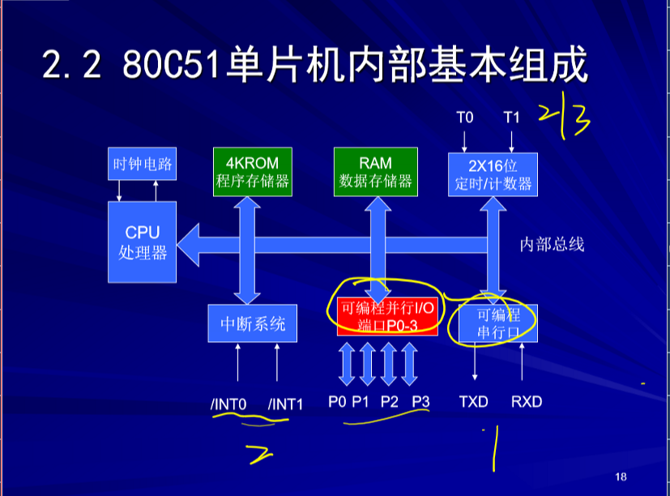

# 80C51

## 基本结构

### 引脚与功能

```
- 电源
- 外接晶体引脚
- 控制线（4条）
	RST/Vpd
	ALE//PROG
		ALE当单片机访问外部存储器是，输出地址锁存信号
			用以锁存P0口送出的低八位地址（P0口的数据/地址时分复用）
	/PSEN
		外部程序程序存储器的读选通信号
		
- 并行输入/输出（P0-P3）
	P0.0-P0.7
		八位双向并行IO口
			输出能力强
			如果系统使用外接存储器，该口作为低八位地址/数据复用总线。此时，P0口不作为IO端口
	P2.0-P2.7
		内部具有上拉电阻的八位准双向并行IO口
		当系统外接存储器时，该口作为高八位地址总线，此时，P2口不在作为IO端口
	P1.0-P1.7
		内部具有上拉电阻的八位准双向并行IO端口
    P3.0-P3.7
    	内部上拉电阻
    	第二功能
 
```




## 80C51的各个模块的基本功能

```
- CPU
- 内部程序存储器ROM
- 内存数据存储器RAM
	RAM:工作寄存器区，位寻址区，栈区，数据存储器（少量）
	SFR:特殊功能寄存器
		用来设定单片机内部各个功能模块的工作方式：中断方式的设定，定时器工作模式的设定
		存放各个功能模块的状态和标志等
- 4个八位并行输入输出端口P0-P3
- 两个十六位定时/计数器
- UART串口：全双工的端口（RXD:接收端，TXD:发送端）
- 中断系统:5个中断源（两个外中断，两个定时计数中断，及一个串行中断）
```

## 指令系统


## CPU

```
运算器
控制器
	程序计数器PC
		存放下一条将要执行的指令代码所在的ROM单元的地址，长度16位
		自动增量功能
	数据指针DPTR
		对片外RAM和IO端口寻址的指针，长度16位
	堆栈指针SP
		长度8位，始终指向栈顶
		初始化时指向堆栈的起始地址
		向上生长型堆栈，入栈是使得SP增量
	指令寄存器
	指令译码寄存器
	定时控制逻辑
```

## 存储器

### 物理分区

``` 
四个存储空间
	片内ROM（4KB） RAM(256B)
	片外ROM(64KB) RAM（64KB）
	RAM不过分区分，RAM通过寻址范围区分片内还是片外

```

### 逻辑区分

```
三个存储空间
	片内RAM
	片外RAM
	ROM
```

### 程序存储器ROM（片内与片外）

MOVC 指令：使用的指针DPTR,PC

程序存储器六个特殊的单元

### 内部数据存储器RAM

访问内部数据存储器单元 MOV

访问外部数据存储器单元 MOVX

### 特殊功能寄存器

SP堆栈指针

八位寄存器，指示堆栈的当前位置

定时计数器

实质上是一个16位的计数器

赋值时分外高低位分别赋值


### P0

```
- 通用IO端口   地址数据复用总线
	- 作为通用IO
		具有较强的驱动能力
		输出时需要外接一个上拉电阻
```


单片机CPU的时序

```
震荡周期T:时序中最小的时间单位
	由外接晶体或者输入时钟决定
时钟周期（状态周期）
	晶体振荡器的真当信号经过片内时钟发生器二分频后的信号
	时钟周期是振荡周期的2倍
机器周期
	CPU执行一条指令所需要的时间的基本单位
指令周期
	
```