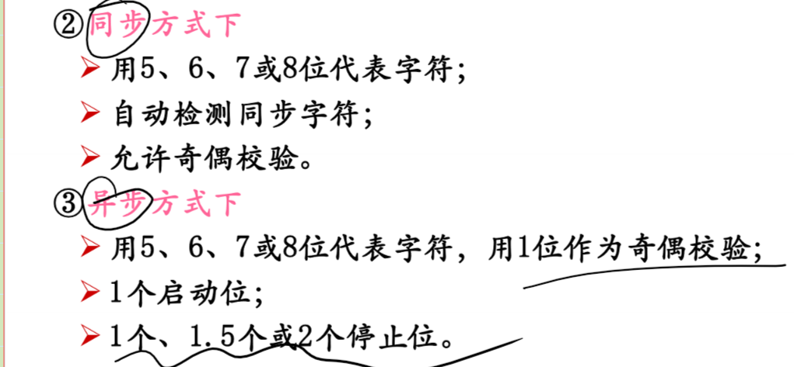
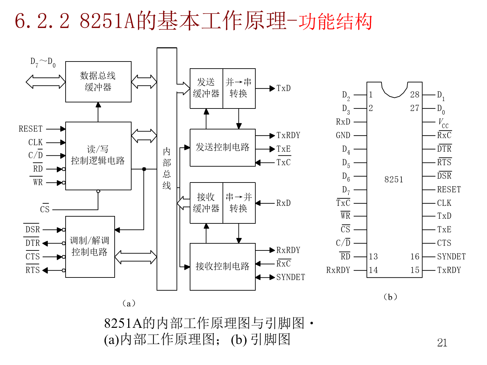
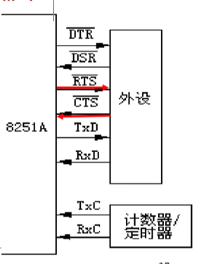
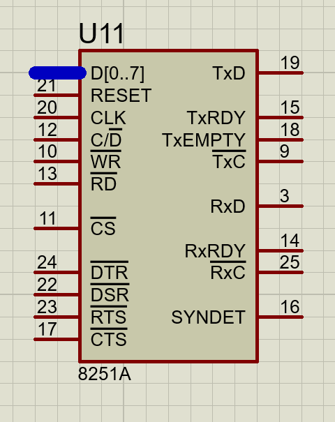
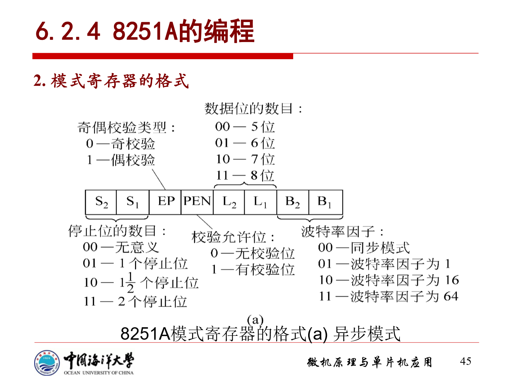
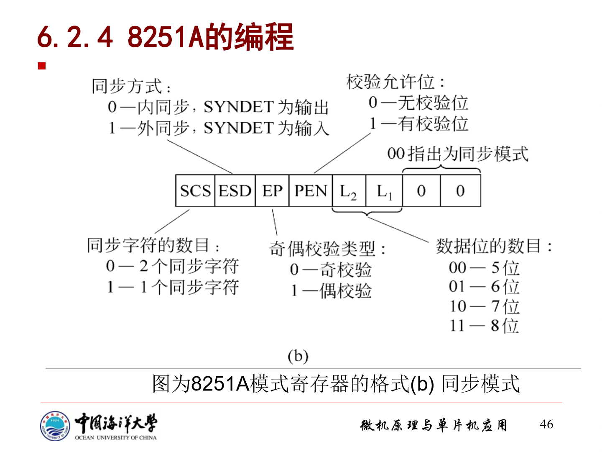
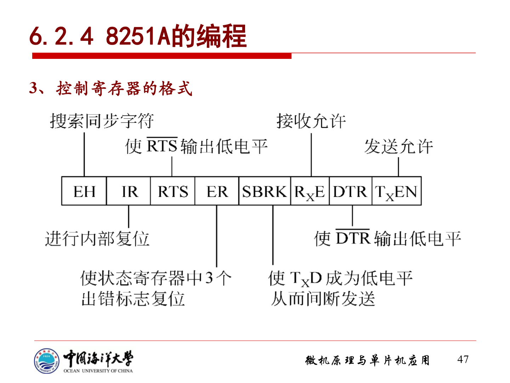
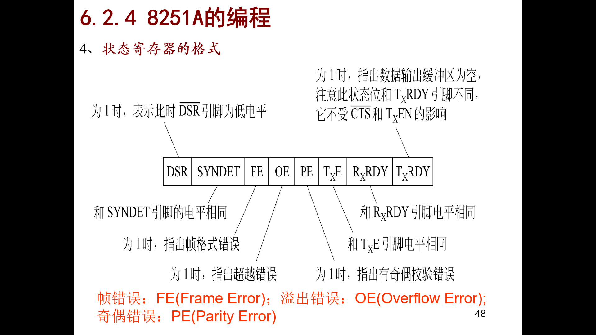

# 接口综述

存储器可以直接挂在到系统总线上，外设不能直接挂在系统总线上

## 接口的基本功能
``` markdown
数据的缓冲与暂存
信号电平与类型的转换
增加信号的驱动能力
对外设进行监测、控制与管理、中断
```

## CPU与IO设备之间的信号

### 数据信息
``` markdown
数字量
模拟量
开关量
```
### 状态信息
``` markdown
外设->CPU
    - BUSY
    - READY
```
### 控制信息
``` markdown
CPU->外设：控制外设的工作
```
## 接口的功能
CPU和外设之间的数据传送方式—>解决CPU与外设之间数据传输时速度不匹配问题

### **程序方式**
#### 无条件传送方式
``` markdown
如果CPU能够确信一个外设已经准备就绪，那就不必查询外设的状态而直接进行数据传输，这就是无条件传送方式
只适用于简单的外设的操作：开关，数码管
输入需要缓冲，输出需要锁存
```


#### 条件传送方式
``` markdown
又名“查询方式”
用条件传送方式时，CPU通过执行程序不断读取并测试外设的状态，当外设处于READY或空闲状态时，CPU输入输出指令与外设进行数据交换
在查询方式下，CPU不断读取状态字和检测状态字，如状态字表明外设并未准备好，则CPU等待，占用CPU的时间
```

### 中断方式
``` markdown
由外设中断CPU的工作，CPU暂停执行当前程序，而去执行一个数据输入输出的程序，此程序称为中断处理子程序或中断服务子程序，中断子程序执行完后，CPU又转回来执行原来的程序
外设主动发起中断请求
CPU本身的功能：
    每条指令执行完后，如有中断请求，那么在中断允许标志位为1的情况下，CPU保留下一条指令的地址和当前的标志，转去执行中断服务子程序
多个中断源产生中断，中断优先级问题？
```

### DMA（直接存储器存取方式）

# 串行接口和串行通信

数据是一位一位进行传输的

每一位数据占用一个固定的时间长度

## 空间

``` markdown
全双工
半双工
单工
```

## 时间

``` 
异步方式：收发双方不用统一时钟进行定时
两个字符之间的传输间隔是任意的，每一个字符的前后都要用一些数位来作为分隔位
起始位：每个字符开始传送的标志，起始位采用逻辑0电平
数据位：数据位紧跟着起始位传送；由5-8个二进制位阻成，低位先传；
校验位：奇校验，偶校验，不传送校验位
停止位：表示该字符传送结束。停止位采用逻辑电平1，可选择1，1.5或2位
---------------------------------------------------------------------------------------------------------------
同步方式：收发双方采用同一个时钟信号定时
以一个固定长度的字符阻成的数据块为传输单位，每个数据块附加一个或两个同步字符，最后以校验字符结束
```

## 串行通信的传输率

``` markdown
波特率：指的单位时间内传送二进制数据的位数，单位为位/秒（bps）

发送时钟：决定数据位宽度的时钟

接收时钟：用与测定每一位输入数据位宽度的时钟

发送/接收时钟=n*波特率

- n为波特率因子，表征多少个时钟周期传输一个bit
- n=1或16或32或64
- 接收端一般n远大于1
```


# 8251A

## 基本性能

可以工作在同步或异步方式


## 基本工作原理



### 七个模块

``` markdown
接收缓冲器
	从RXD引脚上接收串行数据，并按照相应的格式将串行数据转换成并行数据

接收控制电路
	对接收的数据进行检测，检测起始位，校验位，停止位等

发送缓冲器
	把来自CPU的并行数据加上相应的控制信息，然后转换成串行数据从TXD引脚发送出去

发送控制电路
	控制插入起始位，校验位，停止位，同步字符等

数据总线缓冲器
	把8251和系统总线相连，在CPU执行输入/输出指令时，游数据总线缓冲器发送和接收数据
	控制字，命令字和状态信息也通过数据总线缓冲区传输

读/写控制逻辑电路

    接收写信号 /WR，并将来自数据总线的数据和控制字写入8251A
    接收读信号 /RD，并将数据或状态字从8251A送往数据总线
    - C//D：控制/数据信号；C//D   /WR   /RD三个信号组合起来通知8251A当前读写的是数据，控制字，还是状态字
    - CLK：时钟信号
    - RESET：复位信号

调制/解调控制电路
	实现 8251A与调制/解调器的连接
```

### 8251A的发送和接收

#### 异步方式
``` markdown
接收

    在异步方式准备接收一个字符的时候，RxD就在线上检测低电平（没有检测的时候就是高电平），假如这个时候检测到了低电平，8251A就会以这个低电平作为起始位，并且启动内部定时计数器，当计数器到一半数位传输时间（比如初始设置时间脉冲为波特率的16倍），则定时器到第八个脉冲的时候，又重新对RxD进行取样，如果仍为低电平就确定是一个有效的起始位，（如果这个时候为高电平了，8251A会认为刚刚低电平是一个干扰信号，这个过程就重头开始了），8251就开始进行常规取样并进行字符装配（就是每隔一段时间对RxD进行采样）数据进入移位寄存器后（并进行去掉奇偶校验位和停止位），变成并行数据，在通过内部总线送到数据输入寄存器，同时发出RxRDY信号到CPU，表示外设的数据已经收到了，是可用的。对于少于八位的，高位自动填零

发送

    当程序把TxEn（允许发送信号）和CTS#（清除请求发送信号，不懂的朋友再仔细看看上文）后就开始发送。在发送的时候，发送器自动添加1个起始位，再按照初始化的格式添加奇偶校验位，停止位。数据及起始位，校验位，停止位总是在发送时钟的TxC下降沿时发出
```
#### 同步方式

``` markdown
接收

    其实和异步也差不多，就是RxD先进行搜索同步字符，找到第一个数据了，送到移位寄存器移位，然后和同步字符的内容进行比较，相等就是找到了，SYNRET=1；开始接收数据块，不相等就重新来（双同步也差不多，就是第一次找到了再来一次，第二次找不到重头开始找第一个字符）,如果是外同步的话，如果SYNDET=1；的时候，直接开始，RxD就不用找起始位了直接开始采样数据块。
    实现同步之后，就利用时钟信号对RxD进行数据采样，送到移位寄存器移位，然后从RxRDY引脚发出一个信号，表示已经收到了一个字符，一旦CPU读完之后，这个RxRDY=0；

发送

    发送也差不多，程序先对TxEN和CTS#初始化了，这个时候就开始发送，程序会先发1/2个同步字符，然后发送数据块，发送数据块的时候，发送器自动按初始化要求添加奇偶校验位（没有就不加）。如果8251正在发送的时候CPU来不及发送数据了（比如说遇到了中断之类的），那么就会重新发1/2个同步字符，等待CPU。满足了同步字符之间没有空隙。
```


## 8251A的对外信号



### 8251A和CPU之间的连接信号

``` markdown

片选信号

	/CS：CS#，片选信号，由M/IO#和地址译码器得到

数据信号

    - D0-D7：D0-D7        数据传输信号
    8251A的8根数据线D7-D0与8086的数据总线相连

读/写控制信号

    /RD：RD# 读信号，CPU从8251A中读信息
    /WD：WR# 写信号，CPU写入8251A

    8251只有两个端口地址，数据端口是偶地址（输入输出是一个端口），控制信息是奇地址，在8086中是用A1来区分奇偶地址的，如果A1是0，就是偶地址，A1为1就是奇地址，这刚好和C/D#对应了，所以A1脚通常连接C/D#

    | C//D    | /RD     | /WD     | 操作                   |
    |—————————|—————————|—————————|————————————————————————|
    | 0       | 0       | 1       | CPU从8251A输入数据      |
    | 0       | 1       | 0       | CPU往8251A输出数据      |
    | 1       | 0       | 1       | CPU读取8251A的状态      |
    | 1       | 1       | 0       | CPU往8251A写入控制命令  |

收发联络信号

    - TXRDY：发送准备好信号，用来通知CPU，8251A已经准备好发送一个字符

    - TxRDY：发送器准备好，输出，high，表示发送器已经准备好了，这表示发送数据缓冲器空的（没空怎么发啊），CPU可以向8251A发送数据。如果用中断形式的话，这个TxRDY也可以做中断请求信号，如果是查询方式就不断查询它就完事了

    - TxE 发送空信号，输出，high，表示并串转化器为空（数据要经过并串转化器把并行数据转化成串行数据才能发送）。如果8251获得一个数据，TxE就为低。在同步方式下不允许字符串有间隔，但如果CPU来不及给8251A发送数据，则TxE就为1，插入同步字符

    - RxRDY，表示接受器准备好了，可以接受数据了，如果从外设接收到一个数据，等待CPU处理，当然也可以用中断了，把这个当成中断请求信号，程序查询就查他就完事了

    - SYNDET：同步检测信号（只用于同步方式）
    		同步检测/断电检测信号，高有效，输出/输入 同步方式时表示同步检测，如果为内同步，作为输出，输出为1，表示找到同步字了；在外同步的时候，作为输入，变高后，在RxC#（接收器时钟）的下一个下降沿装配字符，在异步方式下，作为空白检测信号，输出，如果接收到全0的字符，输出高电平
```


### 8251A与外设的连接信号

``` markdwon
数据信号
    - TXD
    发送数据信号TXD用来输出数据，CPU送往8251A的并行数据转换为串行数据后，通过TXD送往外设
    - RXD
    接收数据信号RXD用来接收外设送来的串行数据，数据进入8251A后，转换为并行方式

和外设的联络信号
    - DTR#  数据终端准备好了，由8251A发给外设，表示CPU准备就绪
    - DER#  数据设备请求好了，由外设发给8251A，表示外设已经准备就绪
    - RTS#  请求发送信号，由8251A发送给外设，表示CPU已经准备好发送
    - CTS#  清除请求发送信号，由外设发送8251A，表示可以往外设发送数据
    - CLK          8251A的内部时序时钟，同步要求是波特率的30倍，异步的话要求波特率的4.5倍
    - TxC，发送时钟，输入，控制字符的发送速度，同步是等于字符传送的波特率，异步方式是初始化定义的
    - RxC，和TxC差不多，是控制接受端的接受速度

时钟、电源、地
    - CLK：用来产生8251A器间的内部时序
    - TXC:发送器时钟输入，用来控制发送字符的速度
    - RXC:接收器时钟输入，用来控制接收字符的速度
    - VCC
    - GND
```
## 编程



### 8251A的初始化

8251A有一个奇一个偶两个端口地址；

``` markdown
偶地址端口对应数据输入寄存器和数据输出寄存器；
奇地址端口对应状态寄存器，模式寄存器，控制寄存器，同步字符寄存器
```

#### 用偶地址端口时(A1=0)
``` markdown
写入：数据输入寄存器
读出：数据输出寄存器
```

#### 用奇地址端口时（A1=1)(8251A初始化的约定)
``` markdown
第一种描述方法（来自课本）
    芯片复位以后，第一次用奇地址端口写入的值作为模式字送入模式寄存器
    如果模式字中规定了8251A工作在同步模式，那么，CPU接着往奇地址端口输出的就是同步字符，同步字符被写入同步字符寄存器。如此前规定同步字符为两个，则会按先后次序分别写入第一个同步字符寄存器和第二个同步字符寄存器
    此后，只要不是复位命令，不管是同步模式，还是异步模式，由CPU往奇地址端口写入的值都将作为控制字送到控制寄存器，而往偶地址端口写入的值将作为数据，送到数据发送缓冲器

第二种描述方法（来自网络）
    芯片复位之后，第一次用奇地址写控制字，在控制字中规定是同步还是异步；
    如果是同步方式，CPU会接着发1或者2个字节就是同步字符，写入同步字符寄存器，然后再把控制命令字写入奇端口；
    如果是异步方式，CPU往奇端口输出的一个字就是命令控制字；
    在相关命令设置好了之后，只要不复位，用奇端口写控制字，偶端口写的是数据，送到数据输出缓冲器中
```
#### 初始化的概述
``` markdown
- 模式字决定了8251A将工作在同步模式还是异步模式，如果工作在同步模式，还会指出同步字符的个数是一个还是两个；同步字符被写入同步字符寄存器
- 如果是异步模式，则在设置完模式字后，接着便要设置控制字
控制字的主要含义相同，控制字就是各种控制命令，包括复位命令
- CPU向8251A发送控制字之后，8251A首先判断控制字是否为复位命令：如果是复位命令，则返回重新接收模式字；如果不是复位命令，则8251A开始进行数据传输。
```
### 模式寄存器的格式

模式字**8位**

#### 异步模式

需要考虑的量：停止位/校验位/校验允许位/数据位的数目/波特率因子


``` markdown
（从高到低）
前两位是停止位的数目，00非法，01是1位，10是1.5位，11是2位停止位
第三位是EP（奇偶校验类型），0为奇校验，1为偶校验
第四位是有无校验，0是无，1是有
第五第六位是数据的大小，00是5位，01是6位，10是7位，11是8位
最后两位是决定波特率因子（不能是00，00就表示同步通信了），01表示波特率因子为1，10表示波特率因子为16，11表示波特率因子为64
举个例子，异步通信，1个停止位，无校验，8个数据位（刚好最近在做单片机的串口通信，这就是8N1格式）波特率因子为16，则应该向奇端口（假设还是FFF2H吧）写入01001110B，HEX格式为4EH、
- MOV DX,       FFFEH（端口地址）
- MOV AL, 4EH（模式字）
- OUT DX, AL


波特率
同步模式下，发送和接收的波特率分别和/TxC引脚，/RxC引脚上的输入时钟的频率相同
异步模式下，要用模式寄存器中的最低2位来确定波特率因子，
此时满足: /TxC引脚，/RxC引脚上的输入时钟的频率=波特率因子*波特率
```
#### 同步模式

需要考虑的量:同步字符的数目/同步方式/奇偶校验/奇偶校验允许位/数据位的数目/同步模式

``` markdown
（从高到低）
第一位是同步字符的位数，0是2个同步字符，1是1个同步字符
第二位决定是内同步还是外同步，0是内同步，1是外同步
第三位是奇偶校验位，0是奇校验，1是偶校验
第四位是有没有校验，0是没有校验，1是有校验
第五第六位是决定数据块的位数，00是5位，01是6位，10是7位，11是8位
最后两位必定是00
举个例子，比如说现在要求发送的是同步方式，1个同步字符外同步，偶校验，数据位是8位，那么初始化命令字就应该向奇端口（假如为FFF2H）写01111100B，换成16进制就是79H
汇编初始化就应该是
- MOV DX FFF2H
- MOV AL 79H
- OUT DX AL
````
### 控制寄存器的格式


``` markdown
从高到低
第七位：检索同步字符，只用在内同步模式，为1时，8251A会对同步字符进行检索
第六位：使8251A复位，从而重新进入初始化流程
第五位：用来设置发送请求，此位置为1会使得/RTS引脚输出为低电平
第四位：1将清楚状态寄存器中所有的出错指示位
第三位：为1使得引脚TxD变为低电平，于是输出一个空白字符
第二位：接收允许信号，在CPU从8251A接收数据前，先使此位为1
第一位：DTR
第零位：发送允许信号，只有将此位是1时，才能使数据从8251A接口往外设传输
```
### 状态寄存器的格式


``` markdown
```

