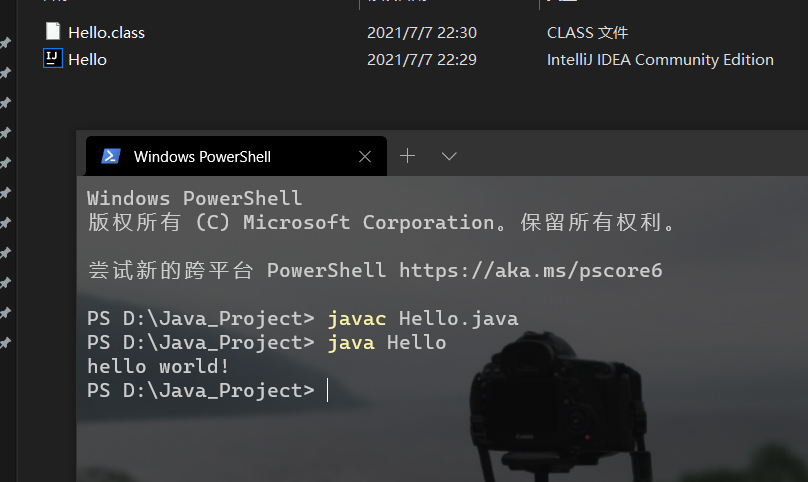
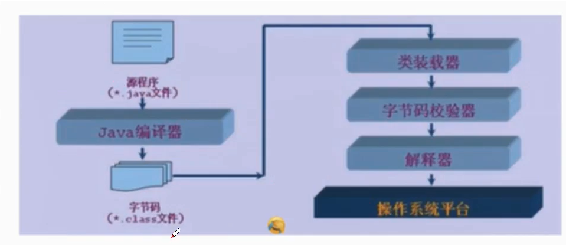

# 前言

- Java用途
  - 网站后台
  - SaaS云
  - app
  - 大数据平台
  - 系统
  - 桌面工具
- 生态
  - 后端
  - 全栈
- 95年诞生于Sun公司，Sun后来被Oracle收购
- 封装！
- TEIOBE网站

- C：底层
  - 内存，指针
- Java摒弃了很多C/C++的问题
- C++：游戏开发
- 相关学习
  - Java基础
    - 语法
    - 面向对象
    - GUI
    - 多线程
    - 网络编程
    - JVM
    - JUC
  - 数据库
    - MySQL
    - JDMC
    - UML
  - 前端
    - HTML
    - CSS
    - JS(JavaScript)
    - jQurery
    - Vue
  - JavaWeb
    - 网站后台
  - SSM框架
    - MyBatis
    - Spring
    - SpringMVC
    - Git
  - Linux
    - 基础
    - Redis
    - Nginx
    - Docker
  - SpringBoot
    - 微服务
  - SpringCloud
    - 微服务，微服务架构
  - Hadoop
    - 大数据的入门


# 预科

- 博客

- markdown

- 计算机

- 硬件

  - 冯·诺依曼体系结构

- 软件

  - 系统
    - DOS
    - Windows
    - Linux
    - Unix
    - Mac
    - Android
    - IOS

- Dos命令
``` bash
  # 盘符切换
  C:\Users\DELL>D:
  
  D:\>dir
   驱动器 D 中的卷是 DATA
   卷的序列号是 90FF-156C
   
   
  # 查看当前目录下的所有文件 dir
  D:\>dir
   驱动器 D 中的卷是 DATA
   卷的序列号是 90FF-156C
  
   D:\ 的目录
  
  2021/07/02  15:50    <DIR>          !!!Learn
  2021/07/07  20:46    <DIR>          !!!Learning_Recording
  2021/06/10  10:20    <DIR>          !!!Master
  2021/07/06  22:21    <DIR>          !!!Temp
  2021/06/04  20:42    <DIR>          !!!Temp_Learn
  2020/03/09  18:06    <DIR>          Adobe Acrobat DC
  2021/03/28  18:26    <DIR>          AE
  
  
  # 切换目录 cd
  D:\>cd PS
  
  D:\PS>cd ..
  
  D:\>cd \d c:
  文件名、目录名或卷标语法不正确。
  
  D:\>cd /d C:   # /d：参数
  
  C:\Users\DELL>
  
  # 清屏
  cls
  
  #退出
   exit
   
   
  # IP查看
  ipconfig
  ipconfig/all
  
  # 打开应用
  C:\Users\DELL>calc
  
  C:\Users\DELL>mspaint
  
  C:\Users\DELL>notepad
  
  # ping 
  
  # 桌面
  C:\Users\DELL>cd /d C:\Users\DELL\Desktop
  
  C:\Users\DELL\Desktop>
  
  # 创建文件夹（make dir）
  md 文件夹名称
  # 删除文件夹（remove dir）
  rd 文件夹名称
  
  #创建文件
  cd>文件名
  #删除文件
  del 文件名
  
```

- 发展史
  - 机器语言：二进制，计算机直接使用
  - 汇编语言
    - 应用：逆向工程，机器人，病毒
  - 高级语言
    - 面向过程
    - 面向对象


# 入门

- 72年：C

- 82年：C++
  - 复杂
  - 图形领域
  - 游戏领域
  
- 95年：Java
  - 语法类似于C
  - 面向对象
  - 无指针
  - 无内存管理
  - 可移植性
  - 高性能
  - 分布式
  - 动态性
  - 多线程
  - Hadoop：大数据
  - Android
  
- 三大版本
  - JavaSE 标准版
  - JavaME 嵌入式开发（几乎消失了）
  - JavaEE 企业级
  
- JDK：Java开发工具

- JRE：Java运行环境

- JVM：Java虚拟机（作用：实现跨平台编译）

- 安装JDK8

``` bash
  PS C:\Users\DELL> java -version
  java version "1.8.0_291"
  Java(TM) SE Runtime Environment (build 1.8.0_291-b10)
  Java HotSpot(TM) 64-Bit Server VM (build 25.291-b10, mixed mode)
```

  - 安装文件夹下的文件
    - bin：可执行文件
      - jav.exe
      - javac.exe
    - include :于C语言相关
    - jre
    - lib
      - 库

- hello world

  - ``` java
    public class Hello //hello是类名要与.java文件名对应
    {
        public static void main(String[] args) //public 小写
        {
            System.out.print("hello world!"); //大写System
        }
    }
    ```

  - 

- java 运行机制
  - 编译型       complie
    - 全部翻译——操作系统
    - C/C++
  - 解释型
    - 边读边翻译——网页
    - python
  - 两者区别：时机不同



- 使用IDEA作为集成开发环境


# 基础语法

## 注释

- 单行注释

- 多行注释

- 文档注释
```java
  /**
   * -*- coding : utf-8 -*-
   * Time       : 2021/7/7 23:49
   * Author     : MurphyHou
   * Proj_Name  : JavaSE
   * File_Name  : Hello.java
   * Software   : IntelliJ IDEA
   * =======Here We Go!=======
   */
  
  public class Hello {
      public static void main(String[] args) {
          System.out.println("hello world");
  
  
          //单行注释
  
  
          /*多行注释*/
          /*
          这是注释
          这是注释
          这是注释
           */
  
         
          //JavaDoc:
          /**
           * 注释
           * 注释
           * 注释
           */
      }
  }
```

## 标识符和关键字

- 关键字

  - 类名，变量名，方法


- 标识符

  - 所有的标识符都应该以字母，美元$，或下划线_开头
  - 首字母之后是任意的字母，或美元$，或下划线_或数字
  - 不使用关键字
  - 注意大小写，A与a不代表同一个变量
  - 可以用中文作为标识符，但是不建议
  - 类名也可以用中文，但也不建议

## 数据类型

- 强类型语言
  - 要求变量的使用严格符合规定
  - 所有的变量都必须先定义后才能使用
  - 高安全性
  - 速度慢
  - 强类型语言：C/C++
  - 弱类型语言：python，JS，VB
  
- 数据类型

  - 基本类型
    - 数值类型
      - 整数类型
        - byte  一个字节
        - short  两个字节
        - int  四个字节
        - long  八个字节
      - 浮点类型
        - float  四个字节
        - double 八个字节
      - 字符类型
        - char   两个字节
    - Boolean类型
      - 占1位，其值只有true和false两个

``` java
  /**
   * -*- coding : utf-8 -*-
   * Time       : 2021/7/8 20:32
   * Author     : MurphyHou
   * Proj_Name  : JavaSE
   * File_Name  : Value_type.java
   * Software   : IntelliJ IDEA
   * =======Here We Go!=======
      */

  public class Value_type {
      public static void main(String[] args) {
          byte a=1;
          short b=2;
          int c=3;
          long d=4L;   //long类型要在数字后面加上l/L

          float e=50.1f;  //float后面加上F/f
          double f=3.1415926;
      
          char g='a';
      
          String h="dwaawdawd";//String 不是关键词，是一个类
      
          boolean flag=true;
          boolean flag1=false;
      }
  }

```

  - 引用类型
    - 类
    - 接口
    - 数组

- 

## 类型转换

## 变量 常量

## 运算符

## 包机制、JavaDoc

