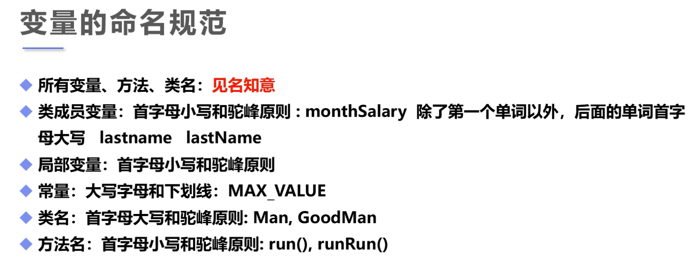
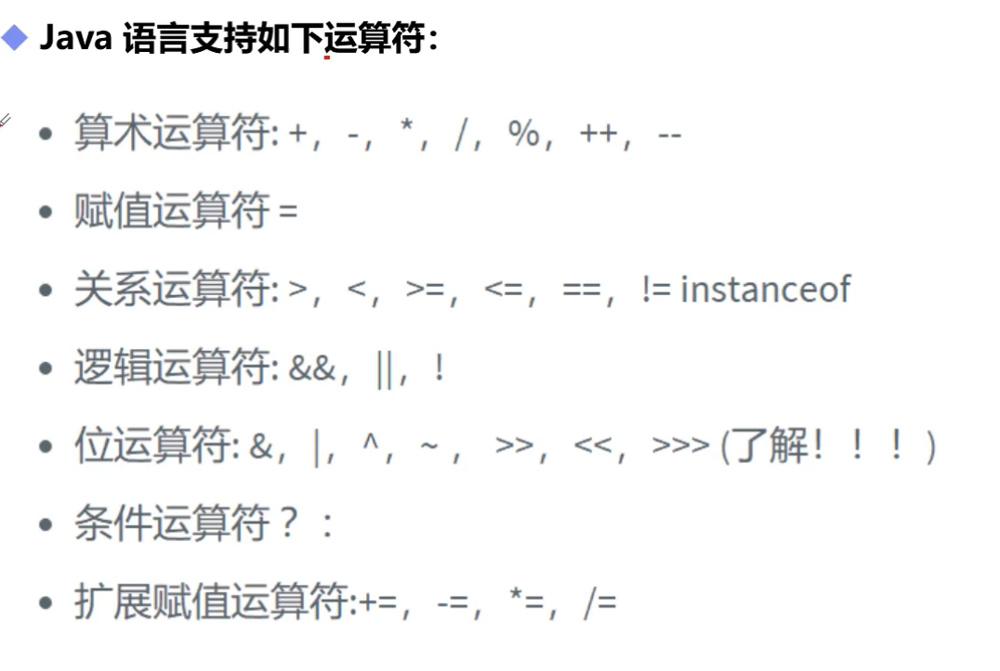
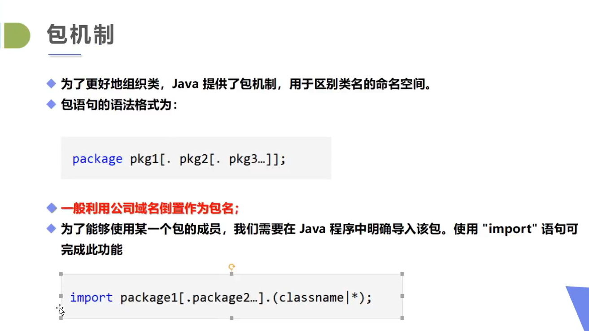
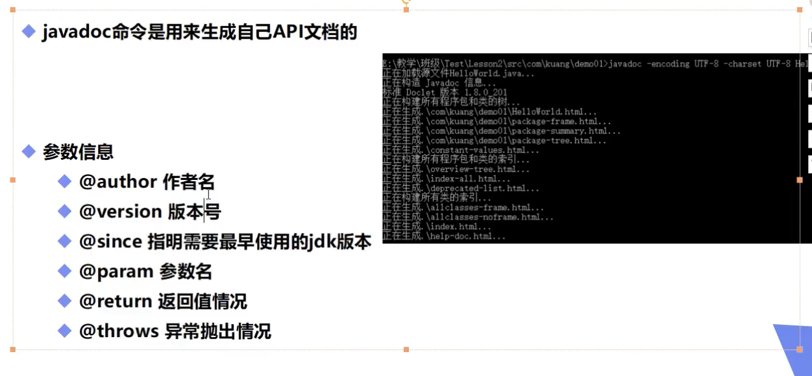

# 前言

- Java用途
  - 网站后台
  - SaaS云
  - app
  - 大数据平台
  - 系统
  - 桌面工具
- 生态
  - 后端
  - 全栈
- 95年诞生于Sun公司，Sun后来被Oracle收购
- 封装！
- TEIOBE网站

- C：底层
  - 内存，指针
- Java摒弃了很多C/C++的问题
- C++：游戏开发
- 相关学习
  - Java基础
    - 语法
    - 面向对象
    - GUI
    - 多线程
    - 网络编程
    - JVM
    - JUC
  - 数据库
    - MySQL
    - JDMC
    - UML
  - 前端
    - HTML
    - CSS
    - JS(JavaScript)
    - jQurery
    - Vue
  - JavaWeb
    - 网站后台
  - SSM框架
    - MyBatis
    - Spring
    - SpringMVC
    - Git
  - Linux
    - 基础
    - Redis
    - Nginx
    - Docker
  - SpringBoot
    - 微服务
  - SpringCloud
    - 微服务，微服务架构
  - Hadoop
    - 大数据的入门


# 预科

- 博客
- markdown
- 计算机
- 硬件

  - 冯·诺依曼体系结构
- 软件

  - 系统
    - DOS
    - Windows
    - Linux
    - Unix
    - Mac
    - Android
    - IOS
- Dos命令

``` bash
 # 盘符切换
  C:\Users\DELL>D:
  
  D:\>dir
   驱动器 D 中的卷是 DATA
   卷的序列号是 90FF-156C
   
   
  # 查看当前目录下的所有文件 dir
  D:\>dir
   驱动器 D 中的卷是 DATA
   卷的序列号是 90FF-156C
  
   D:\ 的目录
  
  2021/07/02  15:50    <DIR>          !!!Learn
  2021/07/07  20:46    <DIR>          !!!Learning_Recording
  2021/06/10  10:20    <DIR>          !!!Master
  2021/07/06  22:21    <DIR>          !!!Temp
  2021/06/04  20:42    <DIR>          !!!Temp_Learn
  2020/03/09  18:06    <DIR>          Adobe Acrobat DC
  2021/03/28  18:26    <DIR>          AE
  
  
  # 切换目录 cd
  D:\>cd PS
  
  D:\PS>cd ..
  
  D:\>cd \d c:
  文件名、目录名或卷标语法不正确。
  
  D:\>cd /d C:   # /d：参数
  
  C:\Users\DELL>
  
  # 清屏
  cls
  
  #退出
   exit
   
   
  # IP查看
  ipconfig
  ipconfig/all
  
  # 打开应用
  C:\Users\DELL>calc
  
  C:\Users\DELL>mspaint
  
  C:\Users\DELL>notepad
  
  # ping 
  
  # 桌面
  C:\Users\DELL>cd /d C:\Users\DELL\Desktop
  
  C:\Users\DELL\Desktop>
  
  # 创建文件夹（make dir）
  md 文件夹名称
  # 删除文件夹（remove dir）
  rd 文件夹名称
  
  #创建文件
  cd>文件名
  #删除文件
  del 文件名
```


- 发展史
  - 机器语言：二进制，计算机直接使用
  - 汇编语言
    - 应用：逆向工程，机器人，病毒
  - 高级语言
    - 面向过程
    - 面向对象

# 入门

- 72年：C
- 82年：C++
  - 复杂
  - 图形领域
  - 游戏领域
- 95年：Java
  - 语法类似于C
  - 面向对象
  - 无指针
  - 无内存管理
  - 可移植性
  - 高性能
  - 分布式
  - 动态性
  - 多线程
  - Hadoop：大数据
  - Android
- 三大版本
  - JavaSE 标准版
  - JavaME 嵌入式开发（几乎消失了）
  - JavaEE 企业级
- JDK：Java开发工具
- JRE：Java运行环境
- JVM：Java虚拟机（作用：实现跨平台编译）
- 安装JDK8

``` bash 
PS C:\Users\DELL> java -version
  java version "1.8.0_291"
  Java(TM) SE Runtime Environment (build 1.8.0_291-b10)
  Java HotSpot(TM) 64-Bit Server VM (build 25.291-b10, mixed mode)
```

  - 安装文件夹下的文件
    - bin：可执行文件
      - jav.exe
      - javac.exe
    - include :于C语言相关
    - jre
    - lib
      - 库

- hello world

``` java
    public class Hello //hello是类名要与.java文件名对应
    {
        public static void main(String[] args) //public 小写
        {
            System.out.print("hello world!"); //大写System
        }
    }
```

  - 

- java 运行机制
  - 编译型       complie
    - 全部翻译——操作系统
    - C/C++
  - 解释型
    - 边读边翻译——网页
    - python
  - 两者区别：时机不同


- 使用IDEA作为集成开发环境

# 基础语法

## 注释

- 单行注释

- 多行注释

- 文档注释

```java
package Base_knowledge;

/**
 * -*- coding : utf-8 -*-
 * Time       : 2021/7/7 23:49
 * Author     : MurphyHou
 * Proj_Name  : JavaSE
 * File_Name  : Base_knowledge.Hello.java
 * Software   : IntelliJ IDEA
 * =======Here We Go!=======
 */

public class Hello {
    public static void main(String[] args) {
        System.out.println("hello world");


        //单行注释


        /*多行注释*/
        /*
        这是注释
        这是注释
        这是注释
         */


        //JavaDoc:
        /**
         * 注释
         * 注释
         * 注释
         */
    }
}

```

## 标识符和关键字

- 关键字

  - 类名，变量名，方法


- 标识符

  - 所有的标识符都应该以字母，美元$，或下划线_开头
  - 首字母之后是任意的字母，或美元$，或下划线_或数字
  - 不使用关键字
  - 注意大小写，A与a不代表同一个变量
  - 可以用中文作为标识符，但是不建议
  - 类名也可以用中文，但也不建议

## 数据类型

- 强类型语言
  - 要求变量的使用严格符合规定
  - 所有的变量都必须先定义后才能使用
  - 高安全性
  - 速度慢
  - 强类型语言：C/C++
  - 弱类型语言：python，JS，VB
  
- 数据类型

  - 基本类型
    - 数值类型
      - 整数类型
        - byte  一个字节
        - short  两个字节
        - int  四个字节
        - long  八个字节
      - 浮点类型
        - float  四个字节
        - double 八个字节
      - 字符类型
        - char   两个字节
    - Boolean类型
      - 占1位，其值只有true和false两个

``` java
package Base_knowledge;

/**
 * -*- coding : utf-8 -*-
 * Time       : 2021/7/8 20:32
 * Author     : MurphyHou
 * Proj_Name  : JavaSE
 * File_Name  : Base_knowledge.Value_type.java
 * Software   : IntelliJ IDEA
 * =======Here We Go!=======
 */

public class Value_type {
    public static void main(String[] args) {
        byte a=1;
        short b=2;
        int c=3;
        long d=4L;   //long类型要在数字后面加上l/L

        float e=50.1f;  //float后面加上F/f
        double f=3.1415926;

        char g='a';

        String h="dwaawdawd";//String 不是关键词，是一个类

        boolean flag=true;
        boolean flag1=false;
    }
}

```

``` java
import java.math.BigDecimal;

/**
 * -*- coding : utf-8 -*-
 * Time       : 2021/7/8 20:53
 * Author     : MurphyHou
 * Proj_Name  : JavaSE
 * File_Name  : Data_expand.java
 * Software   : IntelliJ IDEA
 * =======Here We Go!=======
 */

public class Data_expand {
    public static void main(String[] args) {
        //整数拓展//进制//二进制：0b//十进制//八进制 0//十六进制 0x
        int n1=10;
        int n2=010;
        int n3=0x10;
        System.out.println(n1);
        System.out.println(n2);
        System.out.println(n3);
        System.out.println("==================================");
        //浮点数拓展
        //folat 有限 离散 舍入误差  大约  接近但不等于
        //double

        //最好完全使用浮点数进行比较

        float f=0.1f;
        double d=1.0/10;

        System.out.println(f==d);
        System.out.println(f);
        System.out.println(d);

        float d1=53485468864f;
        float d2=d1+1;

        System.out.println(d1==d2);


        //BigDecimal 数学工具类


        // 字符类型拓展
        System.out.println("==================================");

        char c1='a';
        char c2='中';
        System.out.println(c1);
        System.out.println((int)c1); //强制类型转换

        System.out.println(c2);
        System.out.println((int)c2);


        //字符本身就是数字
        //char 编码：Unicode 2字节  0-65536

        char c3='\u0061';
        System.out.println(c3);  //a

        System.out.println("==================================");
        //转义字符
        System.out.println("hello\tworld");
        // \t:table
        // \n:换行


        System.out.println("==================================");

        String sa=new String("hello world");//对象：内存分析
        String sb=new String("hello world");

        System.out.println(sa==sb);


        String sc="hello world";
        String sd="hello world";
        System.out.println(sc == sd);

        System.out.println("==================================");
        //布尔值拓展
        boolean flag=true;
        if (flag){
            System.out.println("true");
        }

        if(flag==true){
            System.out.println("true");
        }
    }
}
```


  - 引用类型
    - 类
    - 接口
    - 数组

## 类型转换

- 强制类型转换
- 自动类型转换

``` java
/**
 * -*- coding : utf-8 -*-
 * Time       : 2021/7/8 21:19
 * Author     : MurphyHou
 * Proj_Name  : JavaSE
 * File_Name  : Type_conversion.java
 * Software   : IntelliJ IDEA
 * =======Here We Go!=======
 */

public class Type_conversion {
    public static void main(String[] args) {
        //强制类型转换
        int i=128;
        byte b =(byte)i;

        System.out.println(i); //128
        System.out.println(b);  //-128

        //自动类型转换
        int j=128;
        double c =i;

        System.out.println(j); //128
        System.out.println(c);  //-128

        /*
        不对布尔值进行转换
        不能把对象类型转换为不相干的类型
        高容量到低容量：强制转换
        转换：内存溢出，精度问题
         */
    }
}

```


## 变量 常量

- 变量名
- 变量类型
- 作用域
  - 类变量  static
  - 实例变量
  - 局部变量

``` java
/**
 * -*- coding : utf-8 -*-
 * Time       : 2021/7/8 21:33
 * Author     : MurphyHou
 * Proj_Name  : JavaSE
 * File_Name  : Variable.java
 * Software   : IntelliJ IDEA
 * =======Here We Go!=======
 */
//类
public class Variable {
    //属性：变量

    //实例变量：从属于对象;不初始化自动会有默认值
    //数值类型的默认值：0  0.0
    //布尔值默认值是false
    //处理基本类型，其他的默认值都是null
    String name;
    int age;

    //类变量,从属于类
    static double salary=2500;


// 定义常量
    static final double PI=3.14;
    final static double PI1=3.14;
    //final 是修饰符，不存在先后顺序


    //main方法
    public static void main(String[] args) {
        //局部变量：定义在方法里的变量，必须声明和初始化
        //寿命就是在这个方法里

        //变量类型 变量名字=new Variable();
        Variable variable = new Variable();
        System.out.println(variable.age);
        System.out.println(variable.name);

        System.out.println(salary);


        //定义常量

        final
    }

    //其他的方法
    public void add(){

    }
}

```



## 运算符



``` java
package Base_knowledge;

/**
 * -*- coding : utf-8 -*-
 * Time       : 2021/7/8 21:55
 * Author     : MurphyHou
 * Proj_Name  : JavaSE
 * File_Name  : Base_knowledge.Operator.java
 * Software   : IntelliJ IDEA
 * =======Here We Go!=======
 */

public class Operator {
    public static void main(String[] args) {
        //二元运算符

        int a=10;
        int b=20;
        int c=30;
        int d=40;

        System.out.println(a+b);
        System.out.println(a-b);
        System.out.println(a/b);
        System.out.println(a*b);

        long n1=1554687436848656356L;
        int n2=123;
        short n3=10;
        byte n4=8;
        System.out.println("==================================");
        System.out.println(n1+n2+n3+n4);//long  有long则为long，有double则为double
        System.out.println(n2+n3+n4);//int  无long则为int
        System.out.println(n3+n4);//int

        System.out.println("==================================");
        //Math类
        double pow=Math.pow(2,3);
        System.out.println(pow);

        System.out.println("==================================");

        boolean aaa=true;
        boolean bbb=false;

        System.out.println("aaa&&bbb="+(aaa&&bbb));
        System.out.println("aaa||bbb="+(aaa||bbb));
        System.out.println("!(aaa&&bbb)"+!(aaa&&bbb));

        //短路运算
        System.out.println("==================================");
        int ccc=5;
        boolean ddd=(ccc<4)&&(ccc++<4);
        System.out.println(ddd);
        System.out.println(ccc);
        System.out.println("==================================");

        
        //字符串连接符   +
        int num1=10;
        int num2=20;
        System.out.println(""+num1+num2);
        System.out.println(num1+num2);
        System.out.println(num1+num2+"");

    }
}

```


## 包机制、JavaDoc






# 流程控制


## 用户交互 scanner

## 顺序结构

## 选择结构

## 循环结构

## break&&continue
