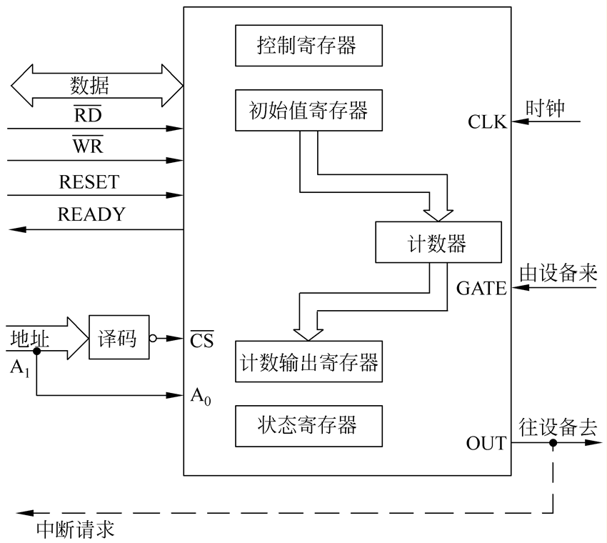

# Ⅶ、8253

## 定时信号
```markdown
一般来说，定时信号可用软件和硬件两种方法得到

软件定时:

根据所需要的时间常数来设计一个延时子程序；
当延时时间较长时，可循环该延时子程序

硬件定时

计数器/定时器：计数时不会占用CPU的资源
```


## 工作原理
```markdown

计数器：在设置好计数初值（即定时常数）后，便开始减1计数，减为0时，输出一个信号

计数器在减到0以后，输出一个信号便结束了，除非重新触发
--------------------------------------------
定时器：在设置好定时常数后，便进行减1计数，并按定时常数不断地输出为时钟周期整数倍的定时间隔

定时器减到0以后，自动恢复初值重新奇数，并不断产生信号


3个独立的16位计数器通道；
共用1个控制寄存器和1个状态寄存器（只有8254有状态寄存器）。
每个计数器有6种工作方式；
按二进制或十进制（BCD码）计数。
```


## 编程结构

8253 内部没有状态寄存器



### 计数器
```markdown

8253内部有三个计数器：计数器0，计数器1，计数器2，其结构完全相同

每个计数器的输入和输出都决定于设置控制寄存器中的控制字，他们共用一个控制寄存器，但相互之间完全独立

内部结构

    三个引脚：时钟输入CLK,门控信号输入端GATE,输出端OUT
    内部部件：16位计数初值寄存器CR,计数执行部件CE,输出锁存器OL

    执行部件实际上就是一个16位的减法计数器，其起始值就是初值寄存器的值，初值寄存器的值是通过程序设置的

    输出锁存器OL用来锁存计数执行部件CE的内容，从而使得CPU可对此进行读操作

    - CE CR OL 都是十六位的寄存器，但也可用作为8位寄存器来用

    计数器的工作方式决定于控制寄存器中的控制字
```

### 工作过程
```markdown

\1. 设置8253\8254的工作方式；

\2. 设置计数初值到计数初值寄存器CR；

\3. 第一个CLK信号使计数初值寄存器的内容置入

计数执行部件CE；

\4. 以后每来一个CLK信号，CE减1； 

\5. OUT端输出一特殊波形的信号；

注：以上计数过程中还受到GATE信号的控制。
```


## 外部信号
```markdown

- CLK0-CLK2：三个计数器的时钟信号

- GATE0-GATE2：三个计数器的门控信号

- OUT0-OUT2：三个计数器的输出信号

- A1,A0：地址线，对三个计数器和控制寄存器进行寻址

        8253有四个端口地址

        - A1A0=00,计数器0
        - A1A0=01，计数器1
        - A1A0=10，计数器2
        - A1A0=11，控制端口

/RD，/RD有效时，CPU对8253的输出锁存器进行读操作

/WR,/RD有效时，CPU对8253的一个计数器写入计数初值或对控制寄存器写入控制字

- CS：/CS有效时，/WR,/RD才会有效
```

## 控制寄存器与控制字

8253内部的三个寄存器共用一个控制寄存器，通过对控制寄存器写入控制字，就可使得三个计数器处于不同的工作模式，控制端口是只写的；

### 模式设置控制字

模式控制字：用来设置三个计数器的工作模式


```markdown
- BCD位：计数初值的格式

此位为0，后面设置的计数初值为BCD码格式，0-9999；
此位为1，后面设置的计数初值为二进制格式，为0-FFFFH

- M2 M1 M0：模式选择位

000 模式0
001 模式1
- X10 模式2
- X11 模式3
100模式4
101 模式5

- RW1 RW0 读写指示位

00 对计数器进行锁存操作，使当前计数值在输出锁存器中锁定，以便读出
01 只读/只写低八位
10 只读/只写高八位
11 先读/写低八位，再读/写高八位

- SC1 SC0 选择计数器

设置模式控制器字时，指出时对哪一个计数器进行设置

00 计数器0
01 计数器1
10 计数器2
11 读出控制字的标识码
```

### 关于的控制字说明
```markdown
1、8253/8254只有一个工作方式控制字，但是对每个计数器而言，它们的工作方式控制字内容一定各不相同（前两位不同），所用各计数器的控制字需要分别设置，先后不计。

2、在工作方式控制字被设置之后，随后必须紧接着给计数器预设置计数初值，计数器方可开始工作。

8253/8254初始化的工作有两个内容：

（1）首先向控制寄存器写入控制字，以选择计数器（3个计数器之一），确定工作方式（6种方式之一），指定计数器计数初值的长度和装入顺序以及计数值的码制（BCD或二进制码）。

（2）然后向已选定的计数器按控制字要求写入计数初值。
```


### 读出控制字

读出控制字：用来读取计数器当前的计数值
```markdown
每个计数器的当前计数值可以被读取，因为计数值是不断变化的，所以在读取前要先进行锁存。读出控制字就是起锁存作用的，所以也叫做锁存命令
- D6 D7 D0：D7D6=11为读出控制字的标识码；D0=0必须是这样设置
/COUNT：如果为0，则将所选计数器的当前计数值进行锁存，以便后面读取
/STATUS：如果为零，则将所选计数器的状态进行锁存
- D3D2D1：分别对应于计数器2，1，0。在一个时刻只能对一个计数器进行锁存
```


## 编程命令

对8253的编程没有顺序规定，非常灵活

三条原则

```
对计数设置初值前必须先写控制字
初值设置时，要符合控制字中的格式规定
要读计数器的当前值和和状态字，必须用控制字先进行锁存
```

### 编程命令

#### 写入命令——针对控制寄存器
```markdown
设置控制字命令，设置初值命令，锁存命令
一个计数器在工作之前，需要先设置控制字对所选择的计数器设定工作模式和计数格式；
设置初值命令用来给出计数的初值
锁存命令是配合读出命令使用的。在读取计数值时，必须先用锁存命令将当前计数值在输出锁存器中锁住，否则，在读数时，计数器的值在变化，就得到一个不确定的结果
当锁存命令到来时，计数执行部件到某一个值，因为锁存器是跟随计数执行部件工作的，所以锁存器中为同一值，此时这一计数被锁住
- CPU将此锁定值读走之后，锁存器自动失效，于是又跟随计数执行部件变化。
在锁存和读出计数值的过程中，计数执行部件仍在不停地作减一计数
```
#### 读出命令——针对计数器
```markdown
读出命令用来读取8253的某个计数器的当前计数值
读取计数器的值之前必须先锁存，再读取
```
## 工作模式

## 基本原则
```markdown
写入控制字时，所有的控制逻辑电路立即复位，输出端OUT进入初始状态（高或低电平）
初始值写入之后，要经过一个时钟上升沿和一个下降沿，计数执行部件才开始计数
通常，在时钟脉冲CLK上升沿时，门控信号GATE被采样
在时钟脉冲的下降沿，计数器作减一操作。

其中0是最大初值，1是最小初值；
```
### 模式0——计数结束产生中断
```markdown
①控制字写入之后，OUT变低；初值装入后，要经过1个CLK的周期（1个上升沿和1个下降沿）后，计数器才开始计数，所以，输出OUT要经过N+1个时钟周期后才有输出；

②输出OUT的有效电平为高电平，并可同时触发中断请求；

③门控GATE的作用：高电平时计数，低电平或下降沿时停止计数；

④CW为写入控制字，N=4表示写入初值，计数值一次有效。
```


### 模式1：可编程单稳态触发器
```markdown
①控制字和初值装入后，OUT变高，在门控GATE的上升沿触发下，经过1个CLK的上升沿和1个下降沿后，计数器开始从初值减1计数，同时使OUT=0；当计数结束（归0）时，OUT=1，使输出产生1个宽度为TW=N×TCLK的负脉冲——单稳态触发器。

②在GATE的上升沿触发下，输出可再次产生1个宽度为TW负脉冲——可重复触发。
```
### 模式2：分频器
```markdown
①控制字装入后，OUT=1为初始状态。

②初值装入后，经过1个CLK的周期，计数器开始从初值减1计数，计到1（不是0）时，使输出OUT=0并保持1个CLK周期，然后OUT=1，开始下一个新的计数周期，使输出为CLK的时钟1/N分频信号，占空比q=（N-1）/N。

③门控GATE的作用：高电平时计数，低电平停止计数；GATE再次变高后从初始值重新计数；而在GATE=1时，计数完成之后自动重新装入初值，循环计数。

④如果计数过程中写入新值.不影响当前计数.完成后重新装入新值
```
### 模式3：方波发生器
```markdown
特点与方式2类似，主要区别：输出方波，其占空比q为

①当N为偶数时，q=0.5；

②当N为奇数时，q=(N+1)/2N。
```


### 模式4：软件触发的选通信号发生器
```markdown
①初值装入后，经过1个CLK的周期，计数器开始从初值减1计数，计数结束（归0）时，使输出OUT产生一个宽度为1个CLK周期的负脉冲——选通信号。

②（用指令）重新装入初值后，经过N+1个CLK周期，又可使OUT产生一个选通信号——（用软件）可重复触发。

③门控GATE的作用：高电平时计数，低电平时停止计数。
```


### 模式5：硬件触发的选通信号发生器
```markdown
①初值装入后，在GATE的上升沿的触发下，经过1个CLK的周期，计数器开始从初值减1计数，计数结束（归0）时，使输出OUT产生一个宽度为1个CLK周期的负脉冲——选通信号。

②用GATE的上升沿可重新触发，使OUT产生一个选通信号——（用硬件）可重复触发。
```


### 8253工作模式小结
```markdown
模式2、4、5的输出波形是相同的，都是宽度为一个CLK周期的负脉冲。

但模式2是连续工作，模式4由软件（设置计数值）触发启动，模式5由门控脉冲触发启动

写入计数值后才能开始计数

模式0、2、3、4在写入计数值后，计数过程就开始了

模式1、5需要外部触发启动，才开始计数

6种方式中只有方式2、3是连续计数，其他4种方式都是一次计数，要继续工作需要重新启动，方式0、4由写入计数值（软件）启动，方式1、5要由外部信号（硬件）启动。

```

## 应用举例

```markdown
```


