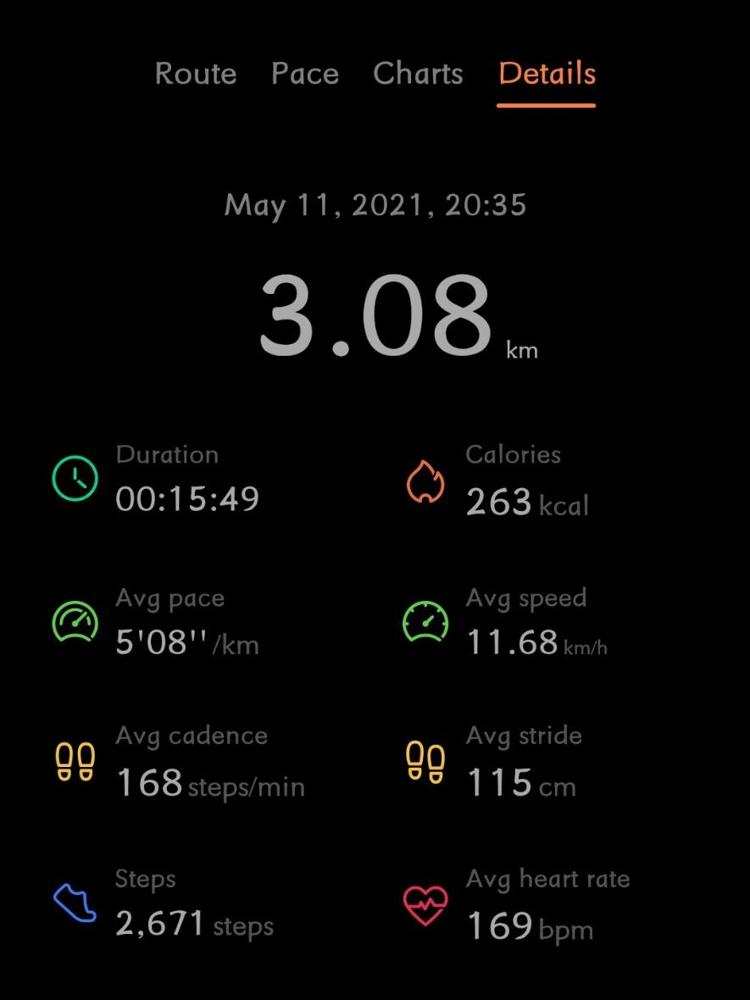

# 2021.5.9

### 周日 晴 无课

- 很长时间没有去做一些课外编程的练习了，**GitHub和Gitee**也已经荒废了好久了，主要是因为学习时间比较紧，有时候一些比较短的时间也不想去打开电脑。但是，这样一直荒废下去不是办法，还是得做起来；
- 今天就定下一个目标吧，不把目标定的很难很远，先坚持每天写一下日记吧。从小到大确实是没怎么写过日记，但是一天天地过得好快，还是最好**每天写一点东西**来记录下比较好。记录一下今天发生的事情，记录一下今天做得很棒的地方，也记下今天做的不足的地方，这个日记暂时计划就用markdown格式来写，以求得熟练使用markdown；
- 时隔将近半年，才想起来自己的**GitHub.io个人网站**还没有正儿八经去做过，H5也忘得差不多了，唉~所以还是复习一下H5的语法，不着急，毕竟又不是什么紧急的事情，还是**以课本学习为主**，无事可做的时候再看看就挺好；
- 目前的日记记录先通过该文件，保存到gitee上，等过段时间，GitHub网站做好了的时候，再把这些记录的东西迁移过去；
- GitHub个人网站的另一个任务是，搭建和**XY的私人小窝**，留下一份美好的回忆，<font color=red>*今天好像惹XY生气了，怪我！*</font>；
- 目前正在看的书是《黑客与画家》，也看了好久了，看的速度也有点慢了，看书都是在毛概课堂上（~~希望毛概老师不要打我~~）；
- 另外，比较令人高兴的是，现在每天都在坚持背单词，和XY两个人相互鼓励，相互督促！加油！！！
- 五月的开始，是一个愉快的假期，这个假期和同学出去游玩了，也去看海拍照了，还有吃饭看电影了；另外也和XY去吃火锅看电影了，也有比较长的时间待在一起了；还有就是做了青岛五四马拉松志愿者，这个假期几乎没怎么学习，过的还是很愉快的，除了<font color=blue>*可能花了比较多的钱*</font>，总之这是个非常愉快的假期；
- 希望这个五月**一切安好**，愿爸妈和亲人身体健康，愿我和XY关系更好，变得更强（doge）；

---


# 2021.5.10

### 周一 计算机网络 微机原理 毛概
- 今天早上没课，赖床了一会儿，八点起床(doge);
- 上午的计算机网络，还是学的ip和子网掩码，新学到了公网和私网ip;
- 下午微机原理课，**好困呀**，好烦，真的被自己气死了，该咋办呀;?????
- 毛概课，没怎么看书，看了会手机，配置了surface上的git，平时也可以用surface做更新;
- 晚上，和xy吃了晚饭
- 晚上，在图书馆，更新了一下网页,但是毕竟是没怎么深入学习,还是看的别人的代码;
- 以后还是再学习一下前端开发再写网页吧，有点太浪费时间了,平时可以简单更新一下网页;
- 晚上还写了作业,神经网络的实验报告;
- 回宿舍还背了英语课文和单词;
- 今天还拍照记录了下一日三餐,手机拍照对我来说不全是拍"大片的",没事可以用来记录生活,希望可以坚持;
- 就像写日记一样,拍照也是一种记录生活的方式,这写记录,希望都可以放到博客上.


---
# 2021.5.11
#### 周二 英语 数据结构 计算机网络 自习 人工神经网络与深度学习基础
- 早上正常起床，洗漱，吃早饭，赶去上课；
- 第一节英语课，表现不尽人意，课堂氛围比较好，但是老师的口语有些时候听不太出来，不知道老师在讲啥，与老师互动了几次，但是表现不是很好；
- 数据结构课，学的是图（网）这一部分，定义部分听得比较认真，但是第二节课，老师讲代码的时候，实在是太无聊了，有点困；
- 下午计算机网路课上机课，对于几个问题还算比较得心应手，但是做题速度有点满，还是需要课下时间继续完成作业；
- 一节自习课，逛淘宝了（doge），然后预习了一会儿英语课文；
- 之后，陪着XY去取了快递；
- 晚上，通识课，老师讲的好无聊，收获不大，总时感觉老师讲的东西用不上；
- 上完课后，去跑步了，三公里，打卡成功！
- 
- 总结一下，上课参与度不高，老师讲课无聊时，还是会感到困！

---

# 2021.5.12

#### 周三 数学物理方法 微机原理 体育 毛概
- **写的东西忘保存了，丢了，哇哇哇哇哇~！！！！**
- 今天上午上的微机原理课，已经讲完了微机原理的上半部分的内容， 接口芯片都讲完了，老师出了一道综合的题目，涉及到了所有已学过的接口芯片，我做了两节课，没做出来，只完成的了芯片的初始化，又累又难受，有好大的挫败感；
- 这一题没做出来，搞得我今天一天的心态崩了，整个这一天人都是心情低落的；
- 究其原因，其实很简单，就是对芯片的知识还没有完成掌握与理解，在应用的时候不能得心应手。
- 今天有点累，眼睛好干，学习也学不动；
- 今晚上，提早从图书馆出来了，放空了一下自我，适度的放松一下。
- 总计今天表现并不好，因为一点点挫败感，整个一天都不算很好。
- 

  

---
# 2021.5.13
#### 周四白天无课 晚上人工神经网络通识课
- 令人震惊的是我今天居然坐在图书馆写了将近一整天的网页！！！！
- 本来今天打算复习微机原理的接口芯片的，但是早上来图书馆不想学习，想先学点有意思的东西，于是我打开B站看了一个爬虫的教程，然后发出了：“就这？”的疑问，这个人就只讲了requests的导入和使用，只能算是简单介绍吧。
``` python
import requests
response =requests.get("https://murphyhou0928.github.io/")
print(response.text)##返回的内容就是网页的源代码 
```

- 然后就想着那就去写写网页吧，这一写就停不下来了，直接写了一整个白天；
- 那就说说现在开发的内容吧
  - 网页的主页基本上开发完毕了，主页的格式，顶部标签栏，底部版权信息，中间的联系方式等都做好了
  - 顶部标签栏第一次跳转到今年的日历，点击今年的某个月份再次跳转到该页面的内容
  - 照片墙做好了
  - 博客还没做好
  - 我想这的是，在博客页面通过某些代码实现插入markdown格式的文本，这个方式暂时还没找到
- 我觉得网页开发基本上就先这样吧，虽然有些简陋，但是大多数时候只是自己在看，至于美化，再找假期等大段时间完成吧
- 接下来的任务是，完成博客栏目的开发
- 敲了一天的键盘手好累~

---

# 2021.5.14

#### 周五 上午没雨 中午小雨 晚上大雨   数学物理方法 数据结构

- 上午数学课听的实在是太难受了，老师突然按照PPT讲课，直接给我来了个措手不及，没提前准备好PPT，上了一节课都没找到老师在讲啥，周末再看看吧，主要就是讲了一种解题方法，做几道题联系一下；
- 数据结构继续讲图的相关知识，这节课讲的主要是图的遍历，深度优先遍历算法和广度优先遍历算法。上课时，对基础相关的知识讲解的时候能听得很懂，但是每当讲解代码的时候，有点蒙圈；
- 下午继续搞网站，使用了开源的editor.md做了Markdwon到HTML的转换；
- 晚上去吃饭了，吃的鱼🐟；
- 因为下雨天🌧，鞋子👟湿了，于是吃完饭🍚就回宿舍了，在宿舍🏠完善了一下网站，目前网站算是基本上完成了，虽然美工方面还有很大的改进空间，但是至少我现在想要的功能都具备了；
- 明天虽然周六，但是还有实验课，自习的时间直接大幅度减少了
- 现在也是时候回顾之前学的知识了，还是把更多的精力花费在学习😀上吧

---

# 2021.5.15

#### 周六 阴雨天气🌧  微机原理与单片机实验 数据结构实验

- 周六但是有实验课✈，早上不算太早，也不算太晚起床，洗漱，然后吃饭；
- 非常想吐槽实验室的条件，唉。。。。实验箱估计有一半是坏的吧，实验箱和电脑都是十几年前的老家伙了吧，Intel i3-2th，太老了，根本没法正常做实验，我的实验台意料之中是坏的，然后只能和其他同学一起做了；
- 实验室的电也坏掉了，空气开关没了，漏电保护没了，只好等了维修师傅来修好了才开始上课的；
- 中午吃完饭🎂去理发了，嗯！比上次好看！（据说）；
- 下午意料之中又是修改网页修改了一下午，唉；
- 下午对网页进行的修改是，使得blog的HTML直接连接到对应的MD文件，不用再通过复制粘贴的方式来转移内容了；
- 做完这个，又把之前的月份拍的照片📸选了选加到了照片墙上；
- 下午开班会，班会时间改网页，嗯（有理有据，眼神坚定（doge🐕））
- 晚上饭后是数据结构实验✈，这实验，居然是抄代码，唉。。。。
- 今天又没学习课本知识，明天还是得写作业啦！！
---

# 2021.5.16

#### 周日 阴雨天气 无课 

- 今天早上起了个大早，结果又睡着💤了，<@_@>；
- 昨晚做了一个好长的梦，梦里好乱，但是醒来什么都没记得；
- 今天早上，人傻了，走到图书馆才发现手里没有提着电脑💻，忘记了电脑是落在了餐厅还是在宿舍没带，脑子里完全不知道在想什么；
- 上午整个人也没有什么精神，没学习📕，看B站；
- 中午人也傻了，自选麻辣烫直接选了18块钱的，超级一大碗🍜，吃饭前忘记拍照了；
- 吃完饭整个人也是傻的，太辣太撑了，躺床上又睡着了💤；
- 看到了无穷小亮的热门动植物鉴定视频，被洗脑了，看了一个小时，😵；
- 下午在图书馆完成了一点点作业；
- 傍晚回去吃饭，时机刚刚好，看到了荚状云，哇！太幸运了，太漂亮了🤣；
- 
- 雨过天晴的青岛太棒了😆；
- 晚上，本来想把刚刚拍的照片更新到网站上，但是网站出问题了，现在我仍然没有解决（所以，现在的文字不能更新到网站上，下周比较忙，也不会频繁更新网站了，所以，现在的文字不知道什么时候能更新上去）；
- 
- 
- 今天整个一天不在状态，不知所措，但是今天的云真的太棒了；

---

# 2021.5.17

#### 周一 晴天 数学 计算机网络 微机原理 毛概

- 数学好难呀，听不太懂唉~
- 数学物理方程这方面老师一直在讲数学物理方程的推导📕，**听不懂**~~
- 计算机网络主要讲授VPN和NAT，具体讲述的**私有IP**是如何接入到的互联网✈🛰；
- 上午上计算机网络突然想到了一个点子，<font color=red>**中文文本加密**</font>！
- 微机原理开始了单片机部分，比微机原理部分要有趣一点，多了具体的实践内容；
- 毛概，继续写网页（*doge*）
- 网页的更新：
  - Blog添加了密码；
  - 静态网页的密码没法放到**服务器**，所以这种密码根本**挡不住**懂这个的人；
  - 做了一点点手机端的适配；
  - 更改了几个背景，做了一点点美化；
- 晚上电脑居然忘记关机了！

---

# 2021.5.18

#### 周二 晴天 英语 数据结构 计算机网络 自习 人工神经网络与深度学习基础

- 英语老师虽然很严厉，上老师的课很有压力，但是大赞张老师，很幸运可以上老师的这门课，这才是英语老师该有的样子，而不是只是讲个课文和单词；
- 数据结构继续学习图的相关算法；
- 计算机网络新学到了RIP动态路由的设置；
- 计算机网络课程进行了随堂测试。我居然忘记了MAC地址的格式（**MAC：8*6=48位位二进制位**）；
- 今天天气太好了，天空是真的蓝，就是太阳太晒了，有点热！
- 
- 


---

# 2021.5.19

#### 周三 晴天 数学物理方法 微机原理 篮球 毛概

- 数学还是听的有点迷糊；
- 微机原理开始将正式讲解单片机部分，
- 篮球课：已经将近有一个月没有打篮球了，测试了一下，一分钟三步上篮4个，及格线6个。。。。
- 毛概课，学了HTML的表格标签，并确定了再添加新的主页标签页叫做project，放置我做的项目的来龙去脉和代码。
- 晚上应为上体育课了太累了，晚上没去图书馆，而是在宿舍更改了网页
- 网页修改
  - 完成了project部分，并添加了两个项目
  - 项目的编写和blog网页用的一样的代码，用markdown编写
  - 完成了词云部分，但仍然有值得挖掘的部分
- 看电脑看的我脑子疼，睡了~

---

# 2021.5.20

#### 周四 阴雨 下午雨后天晴      无课——图书馆自习

- 上午来图书馆修改了网页，下午学习
- 网页修改
  - 主页body部分做了修改，将之前文字呈现的部分改为图标设计
  - 增加了个人介绍部分的页面，但仍然需要完善，增加新的内容（主要是我也没啥值得拿出来秀的啊~~~）
- 下午写了英语，晚上了数据结构的作业
- 今天下午雨后天晴，天空也很好
- 
- 
- 
- 额~~~今天没有怎么在意有什么特别的，在空间和朋友圈看到很多秀恩爱的，也没怎么在意。自己沉浸在了自己的世界中，忽视了女朋友~确实是做的有点不对！

---

# 2021.5.21

#### 周五 数学物理方法

- 今天的数学课总算跟上了，周末做题看看自己是不是真正掌握了！
- 下午做数据结构算法实验，找BUG…………
- 晚上找BUG…………
- 
- 
- 
- 

---

# 2021.5.22

#### 周六  实验课

- 上午实验课做的还算顺利
- 网页修改
  - 写了两个python小应用，旨在高效开发网站，减少没有技术含量的时间浪费
  - 一个是批量重命名
  - 一个是自动化输出一些重复的H5代码：

---

# 2021.5.23

#### 周日  无课

- 上午没去图书馆 下午去图书馆复习数学

- 中午吃了小火锅

---

# 2021.5.24

#### 周一 晴 计算机网络 微机原理 毛概

- 计算机网络学习的是传输层部分的内容：UDP与TCP
- 微机原理学习的是单片机的定时器部分的内容
  - 微机原理为什么总是好困啊？？？？
- 毛概课 第一节课做的评委
  - 这次的代课老师比较负责，认真听了第一节课感觉老师讲的还是很有意义的
- 晚上没去图书馆，在宿舍写了一个别人委托的C++程序
- 晚上还背诵英语
- 英语单词已经好几个晚上没背了，唉，突然有点忙

---

# 2021.5.25

#### 周二 晴 英语 数据结构 计算机网络 人工神经网络与深度学习基础

- 英语课默写的课文，好像没过，第二段背的不熟练，有个句子表达的好像不对
  - 以后英语课文还是要拿出一个周的晚上的时间准备吧，老师比较严格，一晚上的时间准备英语课文还是不太够的
- 数据结构
  - 讲授的AOE网——关键路径，有点没听懂
  - 第二节课进行了前面两章的复习习题课
    - *有些*知识点还是掌握了
    - 但是也有**一些都忘记了（大部分都没掌握熟练）**，当时学的时候就没有完全掌握
      - 树的先根遍历和后根遍历
      - 树，森林，二叉树的相互转换
      - 霍夫曼树和霍夫曼编码——等长编码和不等长编码
      - 邻接矩阵和邻接表
- 计算机网络
  - 练习的是PC与DNS服务器和WEB服务器三者之间的拓扑连接和地址配置
  - 计算机网络还是比较有深度的课程，但是老师教授的少了
  - 湖科大的网课视频还不错，课下希望能快速刷完，总结一下知识点
- 距离期末考试已经差不多只有一个月的时间了，这一个月的时间必须得好好利用这些时间，从现在开始就开始复习，制定好复习计划，不能都拖到期末结课的时候了，还有好几个作业没做，这一周把作业做完，然后着手复习，必须好好利用时间了
- 晚上通识课

---


# 2021.5.26

#### 周三 数学 微机原理 体育 毛概

- 数学课上可以跟着老师的思路了，并且做好了笔记，**老师在讲解公式推导的时候，即使书上有具体的步骤，也最好在纸上跟着老师一起推导一遍**；
- 微机原理课讲授的是单片机的串口，这节课基本上没有打瞌睡，可以跟上老师的思路；
- 体育课，三步上篮和原地补篮练习了整整两节课，因为没有大太阳，天气比较凉爽，效果还不错，每次上篮中的概率在90%吧；
- 毛概课，继续做数学公式的推导；
- 晚上，来图书馆，继续做数学公式的推导；
- 在图书馆发生了一起很迷惑的事情，一个从坐下就在玩手机的人，竟然嫌弃我写字用力大，TMD，我照常写我的，公式推导的正“酣畅淋漓”呢。

---

# 2021.5.27

#### 周四 白天图书馆自习 晚上人工神经网络与深度学习基础

- 今天又是效率低下的一天
- 周四上午九点到图书馆，前一个小时都用了看知乎和哔哩哔哩了；
- 之后看了看网页，更新了project里面的一点内容；
- 然后了解了keil的多个版本，并下载安装了；还安装了Proteus，安装完这些就到中午了，好快啊
- 下午看《窥探》的剧情解说视频直接看到了三点多。。。。。。。
- 然后写完了英语的预习又做了数据结构的作业
- 一下午又这样过去了
- 晚上上完课回图书馆，瞎看了些东西，唉~
- 数学复习剩下的内容其实也不多了，从图书馆回去一定要写完了，不能再拖了
- 另外，制定好学习和复习的计划，必须得高效利用时间了！！！！！

---

# 2021.5.27

#### 周五 数学 数据结构 自习

- 

