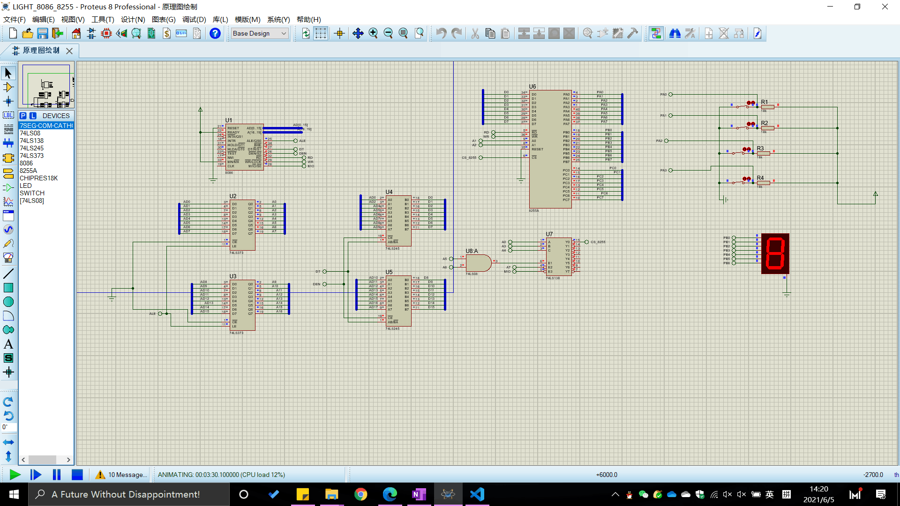
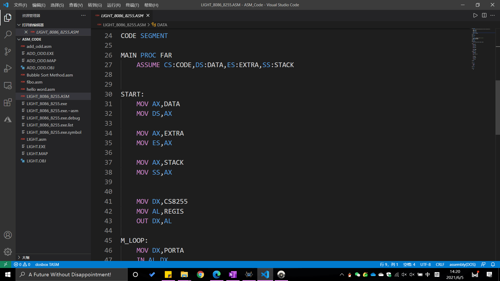
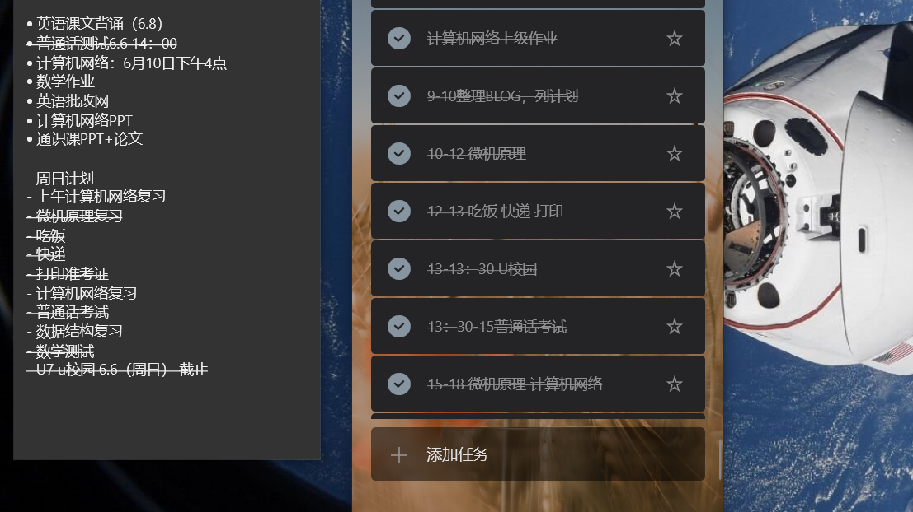
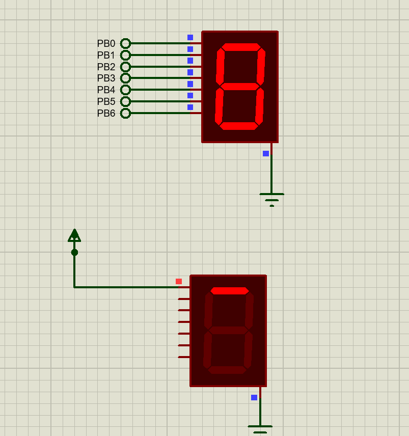

# 我的六月份

- 【整体规划】
  - 六月份是这个学期的最后一个月了，这个月所有的科目都要结课了，因此这个月整体规划就是好好复习，不能都留在考试周复习了；
  - 考试周是七月，这些时间用来查漏补缺，再加上大量的刷题
  - 这个月主要是学习，其他的事情都适当先放一放！
- 【我的目标】
  - 比较高效地复习完所有的科目！
  - 保持一个良好的心态，千万不能慌张！

---

---

---

# 2021.6.1

#### 周二 英语 数据结构 计算机网络 自习 人工神经网络与深度学习基础

- 英语课与之前一样
- 数据结构讲述的二叉排序树的一些操作，新学了B-树
- 计算机网络讲了DHCP服务器，动态分配PC的IP地址
- 之后的自习课先算了一下上个月的花费，然后做了英语新课文的预习
- 

---

# 2021.6.2

#### 周三 数学 微机原理 篮球 毛概

- 数学课学的是傅里叶变换和逆变换，还有其对应的性质；
- 微机原理又布置了单片机的课程设置作业，然后剩余的时间，老师和我们一起从零到无做了一个完整的项目，用的Proteus和Keil，经过老师的演示，对抽象的知识具象化了不少；
    - 下课后，还问了老师两问题；
        - 一是为什么在写C程序时，调用中断程序，不需要中main函数中写出什么时候调用中断？
            - 因为中断程序的执行是根据中断标志位来调用的，设备以一定的时钟周期判断中断标志位的值，当中断标志位符合要求时，中断会执行；
        - 二时while(1);为什么循环体是空的？
            - 因为这while(1);的循环什么都没干，就是停留在while这句话；
            - 当这不是像C程序在运行时，只做这一件事情，要把他考虑成一个大的系统，虽然停在了这句话上，但是80C51还是在执行中断程序。
- 篮球课进行了期末测试，6个几个，9个满分，进了7个球，还算不错，只有一次投篮不是一次性中的，然后补篮竟然补了4，5遍，本来想用身高优势直接把球放进去的，但是还是高估了自己的水平，还是最后投进去的（doge）；
- 毛概课边看木鱼水心的《真探》解说，边写现在的这些内容；
- 毛概课还进行了网页修改，将BLOG中的内容访问删除了密码，觉得没有密码也没有啥；
- 晚上鸿蒙发布会，一句话：“华为NB!”

---

# 2021.6.3

#### 周四 无课 阴雨

- 早上来图书馆开始更改网页，改了一上午，这次做了比较大的改动；
  - 首先是主页上
    - 主页背景换成了毛玻璃效果，身份框也加了毛玻璃效果
    - 导航栏做了重新设计，增加了二级导航栏；
    - 将原来的每个元素占用一个DIV改成了多个元素公用一个DIV，后期再增加也有增加的余地；
    - 但是这个导航栏还有设计的不足之处，不能做好手机端的适配，这个问题先放一放，先做桌面端；
    - BLOG和PHOTO的背景增加了毛玻璃效果；
    - 将原来的每个月份占据一个DIV改成了公用一个DIV，然后放置在左端；
    - 运用iframe做成了html网页的嵌套，直接在catalog文件内显示内容，效果非常好；
    - 但是iframe没搞明白怎么把**窗口位置做移动**
    - 现在就暂停网页的更新，只更新BLOG中的每日记录，得花时间全力复习课本知识了！
- 改网页改了一个上午，中午又下雨，没吃中午饭~~~
- 下午学习！

---

# 2021.6.4

#### 周五 数学

- 数学课学的是傅里叶变换的应用，这部分掌握的还不行;
- 然后讲了数学物理方程的作业，老师讲到了求解CN,DN的简便方法，确实解决了我一大问题，因为求这些参数的积分实在是不好算；
- 然后来了图书馆，结果不想学习
- 中午在宿舍休息了一会儿，然后下午三点来图书馆，开始学习
- 完成了数据结构的算法作业——佛洛依德算法
- 又完成了英语的课文预习
- 总的来说，今天是低效的一天

---

# 2021.6.5

#### 周六 微机原理实验 自习 数据结构实验

- 微机原理实验做的是8086——8255流水灯的设计，没做出来
- 首先是设备是坏的，第二就是没有学会怎么使用这些芯片，不会设计
- 做完实验后，来图书馆学习了Proteus的使用，做了一个开关点亮七段数码管，但是并没有运行出想要的结果。
- 
- 

- 下午开始着手做计算机网络的PPT，之前看过很多相关的资料，但是现在时间久了怎么找都找不到了。。。。。。。。
- 晚上数据结构实验课，很快就“做”完了，昨晚数据结构实验，然后看起来下午做的那个微机原理的仿真实验，还和老师探讨了一下
- 下课后，远程协助和同学演示了一下Proteus的基本操作。
- 总结，今日还是学着了不少东西的，但是时间利用率并不高。

---

# 2021.6.6

#### 周日 晴天 无课

- 早上来图书馆，首先制定好了计划，并且一整天都是按部就班的
- 
- 计划已久的微机原理复习终于开始了，一开始是用markdown文件，但是最后还是选择了OneNote，主要是插入图片和做笔记方便；
- 中午吃完饭，拿了快递，走到半路才发现网络打印准考证了。。。
- 之后发现忘记带身份证了，回去拿身份证和学生证，下楼了才发现拿成了驾驶证，太傻了；
- 普通话考试就考了10分钟，发现自己临场发挥能力太差了，对着电脑都说的思路混乱；
- 之后回啦刷完了U校园，所有的都做完了，考前回来再看一看吧
- 晚上完成了海之子最后一次线下会议，任务基本完成了，大学的社团生活就基本结束了；
- 开完会，和同学聊天，聊了聊选课的事情；
- 晚上本来打算背课文的，忙着忙着又没背课文，周一晚上必须得背课文了；

---

# 2021.6.7

#### 周一 无课 计算机网络 微机原理 毛概 宿舍自习

- 早上没早课，带着电脑去上课，低效复习了一下计算机网络；
- 看了看手机，突然又像换手环了——华为手环6，但是忍了忍，现在还能用，再等等，万一还会更便宜呢
- 计算机网络课学的是网络安全方面的知识
- 下午微机原理课，第一节课太热了，热得坐不住了；
- 第二节课窗外的风吹进来还是比较凉爽的，比较有精神了
- 课后问了老师的周末遇到的问题
- 
- 毛概课复习一下微机原理；
- 晚上回去背课文；
---

# 2021.6.8
#### 周二 英语 数据结构 计算机网络 自习 人工神经网络与深度学习基础
- 早上英语默写过了，老师居然说过几次课要默写单元，我人没了
- 数据结构先学的B+树，不过仅作为了解内容，然后学的是散列查找（哈希表），听的有点迷糊
- 计算机网络做的是子网划分和VLAN划分的综合组网测试
- 之后自习课也没学习，回到宿舍，因为太热了，就简单用Proteus画了电路图，然后去吃饭了，吃了16块钱的水果，热的不想吃东西；
- 晚上通识课

---

# 2021.6.9

#### 周三 数学 微机原理 自习 毛概

- 数学课学的是拉普拉斯变换，有点没听懂
- 微机原理学的是AD转换，上课还算比较精神
- 下午的体育课因为下雨，就上了自习课，本来想复习一下微机原理，但是早上把书放下了，打开surface，这个破电脑又小又卡，各种问题，烦死了，两节课没学习
- 毛概课看了下英语阅读教程
- 晚上回去因为一直下雨也没有去图书馆，回到宿舍看起来木鱼水心的影视解说，晚上洗完澡开始复习计算机网络的组网，总体来说都掌握了；
- **对这段时间做一些总结吧，天气又热又闷，整个人都很浮躁，静不下心了学习，这一周都浑浑噩噩的，没有什么精神**
- **还有很多很苦恼的事情，就不在这里写了……**

---

# 2021.6.10

## 周四 白天无课，晚上人工神经网络与深度学习基础

### 你本可以早一点起床的

- 【记录】
  - 从今天开始更加详尽的记录每天的生活，而不是简单的记流水账，必须有每日的反思与总结，也必须学会承认自己！
  - **突然想给网站再加一个板块，将学习的的内容记录再上面，待定**
- 【反思】
  - 以后买东西绝对要**理性**,不要冲动消费，买任何东西都要与别人商量，与使用过的人商量，不要轻易买，越贵的东西越是如此；
    - 我非常后悔买Surface GO，2019年国庆假期，我看到了surface这款产品，又因为是微软的品牌，对Office的支持肯定是好的（我真******，我才会这么想），于是动了心，甚至都没有考虑好自己的用途到底是什么，就因为这是Windows系统？？？？就因为Office？？？？毫不夸张地说，surface go这款产品除了轻，没有一点优点，这么贵的电脑性能及其拉跨，***，好用的时候就是仅仅能有，不好用的时候真的给人气死！！！售后及其垃圾！
    - Windows可以用来编程，但是这性能也太******的羸弱了吧！！！！！！
    - 仅仅用它的OneNote做笔记这么简单的工作都不能好好完成？？？气死了！！！
    - 平板做笔记确实是挺好的，很多时候真的有很大的作用！！！下一部买iPad！！！！！去他******的微软！
    - 这个假期计划开始正式学习Linux！！！！！Windows本身就是个大BUG！！！！！
  
- 【成就】

---

# 2021.6.11

#### 周五

- 

---

# 2021.6.12 

#### 周六

- 

---

# 2021.6.13

#### 周日

- 

---

