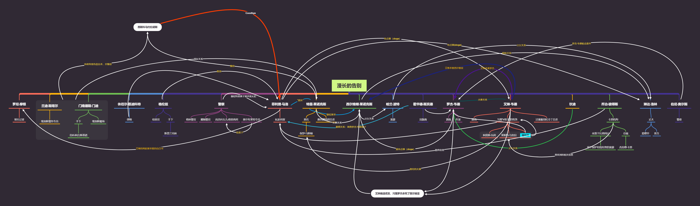

# 1.《球状闪电》
时间：2021.01

关键词：刘慈欣/长篇科幻小说

记录：

- 这是我第一次拿起刘慈欣的书来读，对科幻作品还是比较喜欢的，但也是主要集中在相关的影视作品类。之前对刘慈欣的作品的阅读基本上都是在高中的语文试卷上，刘慈欣在科幻作品领域获得了很高的称赞，并且《流浪地球》的大获成功，让我对刘慈欣的作品充满了好奇；
- 书中描写的这种球状闪电现象简直称得上是奇幻，经过一番查阅之后发现这居然是一种真实存在的自然现象，并且据网上的说法，刘慈欣亲眼见过这种现象，通过自己的想象把这一自然现象变成一部精妙绝伦的小说，不得不佩服大刘！
- 第一次读刘的作品，发现一个很有意思的事情，刘对女性的描写这也太网文的感觉了吧（doge🤣）

``` marldown
这时一个白色的身影轻盈地超过了我和挑夫,这姑娘穿着一件白衬衣和一条白色的牛仔裤,像一道浓缩的白雾。在这缓缓移动的人流中,她的攀登速度快得引人注目。她的脚步轻快跳跃,没有一点儿沉重感,当她经过我身边时,也没有听到喘息声。她回头看了一眼,不是看我,是看那个挑夫,她的表情宁静,看不出一丝疲劳感,苗条的身体似乎没有重量一般,在这累人的山路上攀登,对她来说如同在林荫道上悠闲地散步一样。时间不长,她的身影就消失在白雾中。
```

- 陈博士居然不是主角……好像陈博士到底叫什么名字文中也没交代……
- 总体来说，《球状闪电》我觉得是一部非常好的科幻小说，第一次接触刘的小说就被这个男人深深吸引住了，书中的每个人物都对我产生的很强的吸引力，也特别喜欢刘在其作品中展现的世界观念，被深深吸引主了。

# 2.《超新星纪元》
时间：2021.01

关键词：刘慈欣/长篇科幻小说

记录：

- 一个巨大的脑洞！
- 《超新星纪元》讲述的时御夫座一颗超新星爆发，对地球产生了巨大的影响，地球上12岁以上的人都患病逐渐离世，这个时间掌握在了一群12岁以下的孩子手中，不得不佩服这是一个巨大的脑洞；
- 最令我震撼的是，与我们所熟知的小孩子的纯洁不同的是，这个由小孩子领导的人类文明，是如此的美好而又可怕；
- 孩子们一开始对大人的离开而害怕，但是一步步地克服了困难，逐步使整个国家安定下来。第一次全国大会上，孩子们发表了自己对美好国家的愿景，开始经过糖城时期与沉睡时期；
- 大洋彼岸的美国的糖城时代居然是战争，讽刺！
- 当世界上的国家开始接触之后，矛盾逐渐显现出来，甚至将奥运会变成了一场战争，最后都动用了核弹！
- 我们所认知的孩子大多数都是纯洁的，但在这本书中，我们实实在在地看到了孩子们是扮演天使的恶魔，战争成了游戏，武器整理玩具，对生命如此漠视，最后甚至都交换了国土！

# 3.《漫长的告别》
时间：2021.02

关键词：雷蒙德·钱德勒/长篇推理小说

记录：



- 这本书的结构与人物关系实在是太复杂了……
- 这小说与经典的推理小说《福尔摩斯探案集》的风格差别太大了，主人公马洛一点没有主角光环，是一个贫穷却又高贵的私家侦探形象。


# 4.《三体Ⅰ：地球往事》
时间：2021.02

关键词：刘慈欣/长篇科幻小说

记录：


# 5.《三体Ⅱ：黑暗森林》
时间：2021.02

关键词：刘慈欣/长篇科幻小说

记录：


# 6.《三体Ⅲ：死神永生》
时间：2021.02

关键词：刘慈欣/长篇科幻小说

记录：


# 7.《腾讯传》
时间：2021.02

关键词：吴晓波/商业/传记

记录：

- 马化腾：大胆心细，谨慎沉稳，默默做事情！
- 企鹅帝国"三宗罪"
  - 一直在模仿从来不创新
  - 走自己的路让别人无路可走
  - 垄断平台拒绝开放


# 8.《人生由我》
时间：2021.02

关键词：梅耶·马斯克/传记

记录：

- 埃隆·马斯克的硬核妈妈也确实很硬核！
- 本书是站在女性角度去写的她自己的故事以及对女性的忠告，个人觉得还有有一定的深度的，但是她作为一个西方国家的人，我们应该考虑，这些建议对东方女性可能不是要全盘接收；
- 另外比较惊喜的是，全书对她三个孩子的着墨数量是相当的，并没有因为埃隆·马斯克最有效而大量地吹嘘，夸赞！

# 9.《华为成长之路》
时间：2021.02

关键词：邓斌/商业/传记

记录：

- 华为是我非常喜欢的一家公司，这本书总结华为发展史上的22个关键事件，给出了企业在不同成长阶段的不同的最重要的因素；
- 生命周期所经历的四大阶段：产品定位期（聚焦于“做成”）、市场复制期（聚焦于“做大”）、管理规范期（聚焦于“做强”）、生态联动期（聚焦于“做久”）；
- 书中让我最震撼的是”市场部集体大辞职“事件~
  - 一是开创了华为干部能上能下的文化，使得在华为“三上三下”的干部大有人在；二是加强了公司对干部的管理和控制力度；三是进一步树立了任正非的领导权威，让员工明白领导者的权威不容挑战。
  - 我觉得这一步走的是非常的勇猛，对于一艘正在行驶的巨轮，突然面对集体大换血，是多么的不容易
- 任正非的个人魅力在一定程度上对华为的影响非常之大！

# 10.《美国陷阱》
时间：2021.02

关键词：弗雷德里克·皮耶鲁齐/经济/传记

记录：

- 首先称赞一波这本书，这本书让我认清了美国丑恶的嘴脸！
- 法国能源巨头阿尔斯通高管皮耶鲁齐被美国司法部逮捕，作为美国通用收购阿尔斯通谈判的筹码，美国利用其《反海外腐败法》打击美国企业的竞争对手，美国利用其权力和暴力手段，直接或者间接扰乱世界秩序！
- 现在的华为也正面临着阿尔斯通相似的境地，孟晚舟在加拿大被捕，美国动用举国之力，去打压一家中国的私企！

# 11.《国家地理终极观星指南》
时间：2021.03

关键词：霍华德·施耐德/星空观察/指导书

记录：

- 初级星空观测书籍，是天文摄影师叶梓颐推荐的一本书；
- 对星空观测与星座等有了初步的认识

# 12.《仿生人会梦见电子羊吗？》
时间：2021.04

关键词：菲利普·迪克/科幻小说

记录：

- 这本书所改变的影视作品《银翼杀手》是比较经典的科幻电影；
- 故事的背景在人类所生存的环境已经崩坏，出现了越来越多的仿生人，仿生人也在不断地更新迭代，以躲过赏金猎人的追杀
- 书的主人公就是这么一位追杀逃亡仿生人的赏金猎人。

# 13.《黑客与画家》
时间：2021.04

关键词： 保罗·格雷厄姆/硅谷/互联网

记录：

- 黑客已经被人们错认为是一个贬义词了，但其本义是精通计算机编程的人；
- 作者是硅管著名的创业家，被称为硅谷创业之父
- 摘抄
  - 创造优美事物的方式往往不是从头做起，而是在现有的成果的基础上做些小小的调整，或者将已有的关掉用比较新的方式组合起来
  - 唯一有效的外部考核就是时间。经过岁月的洗礼，优美的东西生存发展的机会更大，丑陋的东西往往会被淘汰。
  - 编程语言是用来帮助思考程序的，而不是用来表达你已经想好的程序的
  - 真正竞争软件设计的战场是新兴领域的市场，这里还没有人建立过防御工事
  - 你有一份为了赚钱的工作，还有一份为了爱好的工作
  - 应该定期地从头开始，不要长年累月地在一个项目上不断工作
  - 黑客的出发点是原创，最终得到一个优美的结果；而科学家的出发点是别人优美的结果，最终得到原创性
  - 开源运动
  - 从他人的角度思考问题正是成功的奥秘所在
  - 判断一个人是否具有换位思考的能力有一个好办法，那就是看他怎么向没有技术背景的人解释技术问题
  - 程序写出来是给人看的，附带能在机器上运行
  - 编程到底能够有多酷，取决于我们能够用这种新媒介做出怎样的工作

# 14.《呐喊》
时间：2021.07

关键词：鲁迅/小说集

记录：

- 《狂人日记》《孔乙己》《药》《明天》《一件小事》《风波》《头发》《阿Q正传》《白光》《端午节》《鸭的喜剧》《社戏》《兔和猫》
- 看了觉醒年代，突然对那个时代充满了好奇，对鲁迅先生的作品充满了好奇；
- 《狂人日记》是中国第一篇白话文小说，在新文化运动中有着重要的作用，对封建吃人般的现状有是深刻的批判；


# 15.《彷徨》
时间：2021.07

关键词：鲁迅/小说集

记录：

- 《祝福》《在酒楼上》《幸福的家庭》《肥皂》《长明灯》《示众》《高老夫子》《孤独者》《伤逝》《弟兄》《离婚》


# 16.《流浪地球》
时间：2021.07

关键词：刘慈欣/短篇小说

记录：

- 小说流浪地球与电影的最大区别在于，电影中的高潮是地球受木星强大的引力所影响超过了洛希极限，刘培强驾驶飞船点燃木星，使得地球摆脱了木星的吸引，在引力弹弓效应影响下，地球的速度达到太阳系的逃逸速度，可以冲出太阳系；小说的高潮是，对太阳毁灭的质疑，对流浪地球的质疑，导致地球上发生叛乱，打算重新回到地球之前的轨道，但在这时，太阳发生了氦闪，太阳不再存在，地球真正成为流浪的孩子，直到找到新的恒星。


# 17.《朝闻道》
时间：2021.07

关键词：刘慈欣/短篇小说

记录：

- 科学家丁仪等创造了人类最大的粒子加速器——爱因斯坦赤道，打算一举找到宇宙的最终真理，探寻宇宙大一统模型；
- 但这被宇宙排险者阻止了，因为这个加速器会导致整个宇宙的毁灭，宇宙排险者不允许地球人继续探索宇宙的大一统模型，但是丁仪等科学家心有不甘，想通过宇宙排险者知道宇宙的真理，于是与排险者达成协议，排险者告诉科学家真理，10分钟之后，排险者杀掉这些科学家；
- 如果你有机会知道宇宙的真理，然后杀掉你，这笔交易你会做吗？我想我的答案是：YES！


# 18.《赡养人类》
时间：2021.07

关键词：刘慈欣/短篇小说

记录：

- 讽刺资本主义的残酷与腐朽，资本主义对资产的运作使得贫富差距越来越大，乃至空气的所有权都集中在某个人手中；
- 教育可以让穷人变成富人，但是教育成本高到一定程度时，穷人只会是穷人，富人会越来越富有，乃至穷人和富人变成两个物种。


# 19.《鲸歌》
时间：2021.07

关键词：刘慈欣/短篇小说

记录：

- 鲸歌中的科幻元素我觉得并不是很多，这是刘慈欣1999年发表的作品，讲述的只是一个非常简单的故事；
- 人类利用鲸鱼做非法贩毒，鲸鱼却被非法的捕鲸船所杀。
- 高科技与道德之间的平衡是人类一直所寻求的，科技再怎么发达都必须有道德的束缚。


# 20.《地火》

时间：2021.07

关键词：刘慈欣/短篇小说

记录：

- 《地火》这篇作品，我觉得是刘慈欣这几篇短篇小说中，完成度最高的，也是最具有反思意义的；
- 当我们面对一种新的技术，这种技术对人类目前的现状会产生非常大的影响，但是我们必须得抑制住自己的激动心情，必须冷静思考，我们能否驾驭这种力量，我们是否对其充分了解，有完整的应急措施。
- 我觉得越是重大的科学成果，在真正应用时，越是得充分地，理性地考虑，一个非常的典型地例子，核电站。


# 21.《地球大炮》

时间：2021.07

关键词：刘慈欣/短篇小说

记录：

- 这篇小说我觉得前期部分，个人评价是，我觉得不是很好，特别是复仇的动机很难成立；
- 科学家的孩子受到科学家的思想的影响，所作出的东西对人类产生了不好的成果，那么责任在于在科学家自己?我觉得这个值得仔细考虑；
- 《地球大炮》与《地火》所表达的情感有些类似，都是科学技术的发展对人类社会会产生影响，这个影响或许是好的，但有时候也可能是坏的，甚至给人类带来巨大的灾难，但从长远看来，这项新的科学技术对人类可能产生积极的影响，我们不应该害怕短期的结果不好而放弃，人类对未知的探索精神是永远不能放弃的，是人类最宝贵的品质之一。


# 22.《带上她的眼睛》

时间：
关键词：刘慈欣/短篇小说

记录：

- 这部作品中，并没有很宏大的世界观，也没有很多高科技，科幻的元素也不多，但深深地震撼了我！
- 宇航员即使已经飞到太空中，可以看到宇宙的壮观，但是他们仍然惦记着地球上的花草树木，日出日落，渴望感受地球上的阳光，地球上的风雨！
- 这篇文章的高潮部分在于，“她”不是宇航员，而是地航员，深入地底探索，但是过程中出现了意外，  她被永久地困在了地底下，将孤独一辈子，在与地面断了联系的时间中，在她的余生中，她最惦记的还是地球的自然元素。
- 我们没有被困住，自然对我们来说触手可及，我们不应该对此麻木，更应该去拥抱自然，去发现美好。


# 23.《诗云》

时间：
关键词：刘慈欣/短篇小说

记录：

- 超越李白的诗词不是被挑选出来的，而是被创造出来的；
- 技术就是再强大，也有其做不到的方面；


# 24.《白垩纪往事》

时间：
关键词：刘慈欣/短篇小说

记录：

- 恐龙是有强大的大脑，但却有笨拙（巨大）的双手，恐龙是思考者，蚂蚁没有强大的大脑，但是可以从事精密制造等，这篇作品的前期所写的是恐龙与蚂蚁之间相互合作，互利共生，也只有这两者紧密合作，才可以共赢；但两者毕竟是两种不同的物种，当两者之间的矛盾与猜忌达到一定程度时，这个平衡关系将被打破，最后两败俱生。
- 很难做一个结论说，两者之间究竟应该怎么样，两种关系都会带来好处，也会带来坏处！
- 从人类角度看待这种问题，人类既有强大的大脑，也有灵活的双手，人类是很幸运的；但是将问题放大，整个世界也确实被分成两部分，发达国家和发展中国家，发达国家就是恐龙，发展中国家就是蚂蚁！


# 25.《全频带阻塞干扰》

时间：
关键词：刘慈欣/短篇小说

记录：

- 这部作品中关于战争的元素太多了，对未来的战争也充满了思考；
- 电磁波技术的应用，使得现代化战争可以在千里之外便可以调动战场上的士兵与武器，但是电子干扰技术的出现，使得电磁波不再是万分的安全，往极端了考虑，当使用全频带阻塞干扰时，敌我双方都是战场上的瞎子，信息作战将完全失效。


# 26.《》

时间：
关键词：

记录：


# 27.《》

时间：
关键词：

记录：


